# Daten in Campaign importieren {#ootb-profiles}

Mit Campaign können Sie der Datenbank Kontakte hinzufügen. Sie können eine Datei laden, mehrere Kontaktaktualisierungen planen und automatisieren, Daten im Internet sammeln oder Profilinformationen direkt in die Empfängertabelle eingeben.

Profilimporte werden in speziellen Vorlagen konfiguriert, die durch Workflows über die Aktivität **Importieren** ausgeführt werden. Sie können automatisch anhand eines Zeitplans wiederholt werden, um beispielsweise den Datenaustausch zwischen verschiedenen Informationssystemen zu automatisieren. Weiterführende Informationen finden Sie in [diesem Abschnitt](../../automation/workflow/recurring-import-workflow.md).

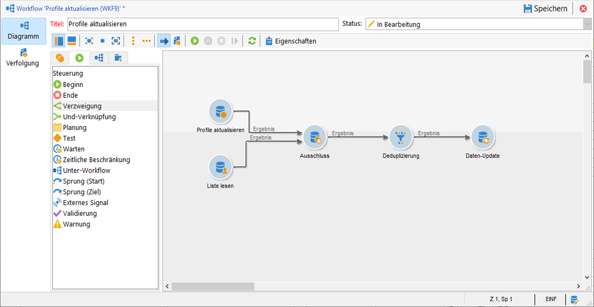

## Import ausführen

Mit Adobe Campaign können Sie Daten aus einer oder mehreren Dateien im Text-, CSV-, TAB- oder XML-Format in die Datenbank importieren. Diese Dateien sind mit einer Tabelle (Haupttabelle oder verknüpfte Tabelle) verbunden; jedes Feld der Quelldateien ist mit einem Feld der Datenbank verknüpft.

>[!NOTE]
>
>Um Daten zu importieren, ohne sie mit Daten in der Datenbank zu mappen, steht die Funktion **[!UICONTROL Liste importieren]** zur Verfügung. Diese Daten können dann ausschließlich in Workflows mit dem Objekt **[!UICONTROL Liste lesen]** verwendet werden. Weitere Informationen hierzu finden Sie auf [dieser Seite](../../automation/workflow/read-list.md).

## Verwenden des Importassistenten

Mit dem Import-Assistenten können Sie einen Import konfigurieren, seine Optionen definieren (z. B. Formatierung) und die Ausführung starten. Es handelt sich dabei um eine Reihe von Bildschirmen, deren Inhalt von der Art des Imports (einfach oder mehrfach) und den Rechten der Benutzerin bzw. des Benutzers abhängt.

Der Import-Assistent wird nach der Erstellung eines neuen Importauftrags angezeigt.

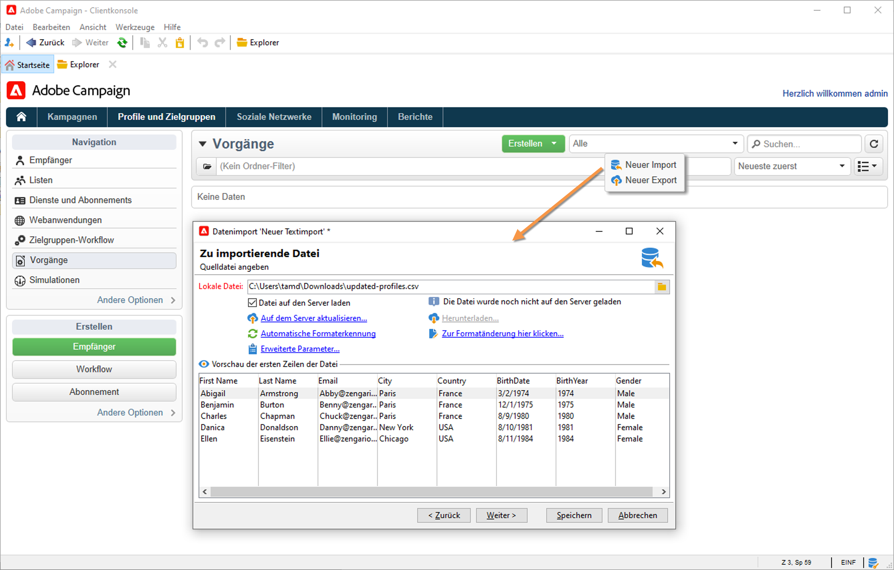

In der Quelldatei entspricht jede Zeile einem Datensatz. Die Daten in Datensätzen werden durch Trennzeichen (Leerzeichen, Tabulatoren, Zeichen usw.) voneinander getrennt. Das bedeutet, dass die Daten in Form von Spalten abgerufen werden und jede Spalte mit einem Feld der Datenbank verknüpft ist.

### &#x200B;1. Schritt – Importvorlage auswählen {#step-1---choosing-the-import-template}

Beim Start des Import-Assistenten muss zunächst eine Vorlage ausgewählt werden. Um beispielsweise den Import von Empfangenden zu konfigurieren, die einen Newsletter erhalten haben, gehen Sie folgendermaßen vor:

1. Gehen Sie zum Ordner **[!UICONTROL Profile und Zielgruppen > Auftrag > Allgemeine Importe und Exporte]**.
1. Wählen Sie **Neu** und danach **Importieren**, um die Importvorlage zu erstellen.

   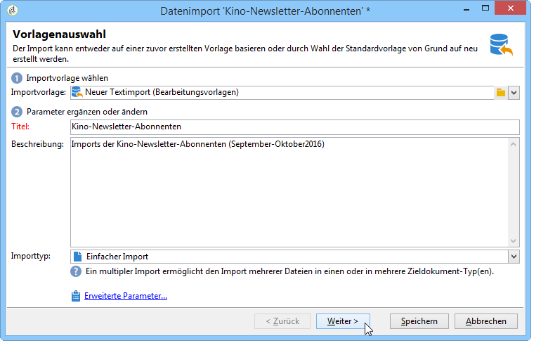

1. Klicken Sie zur Auswahl der gewünschten Vorlage rechts vom Feld **[!UICONTROL Importvorlage]** entweder auf den Pfeil oder auf **[!UICONTROL Verknüpftes Element auswählen]**, um den Navigationsbaum zu durchsuchen.

   Die native Vorlage lautet **[!UICONTROL Neuer Textimport]**. Diese Vorlage darf nicht geändert werden. Sie können sie jedoch duplizieren, um eine neue Vorlage entsprechend Ihren Anforderungen zu konfigurieren. Standardmäßig werden Importvorlagen im Knoten **[!UICONTROL Ressourcen > Vorlagen > Bearbeitungsvorlagen]** gespeichert.

1. Geben Sie im Feld **[!UICONTROL Titel“ einen Namen]** den Import ein. Sie können eine Beschreibung hinzufügen.
1. Wählen Sie anschließend den Importtyp aus. Es gibt zwei mögliche Importtypen: **[!UICONTROL Einfacher Import]**, um nur eine Datei zu importieren, und **[!UICONTROL Mehrfacher Import]**, um mehrere Dateien in einer Ausführung zu importieren.

   Wählen Sie zum gleichzeitigen Importieren mehrerer Dateien im ersten Schritt des Import-Assistenten aus der Dropdown-Liste des Felds **[!UICONTROL Importtyp]** die Option **[!UICONTROL Multipler Import]** aus.

   

1. Geben Sie dann die zu importierenden Dateien an, indem Sie für jede Datei auf **[!UICONTROL Hinzufügen]** klicken.

   

   Jedes Mal, wenn eine Datei hinzugefügt wird, wird der Bildschirm des Assistenten **[!UICONTROL Zu importierende Datei auswählen]** angezeigt. Lesen Sie den Abschnitt [2. Schritt - Quelldatei auswählen](#step-2---source-file-selection) und befolgen Sie die Schritte im Assistenten, um die Importoptionen wie für einen einfachen Import zu definieren.

   >[!NOTE]
   >
   >Multiple Importe sollten nur in bestimmten Situationen durchgeführt werden und sind nicht empfehlenswert.

#### &#x200B;2. Schritt – Quelldatei auswählen {#step-2---source-file-selection}

Die Quelldatei kann entweder in Textformat (TXT, CSV, TAB, feste Spalten) oder in XML vorliegen.

Standardmäßig ist die Option **[!UICONTROL Datei auf den Server laden]** angekreuzt. Durchsuchen Sie Ihre lokale Festplatte, indem Sie auf das Ordnersymbol rechts vom Feld **[!UICONTROL Lokale Datei]** klicken und wählen Sie die zu importierende Datei aus. Sie haben die Möglichkeit, diese Option abzuwählen und den Pfad und Namen der Datei anzugeben, wenn sie sich bereits auf dem Server befindet.

Wenn die Datei angegeben wurde, können Sie deren Daten im unteren Bereich des Fensters anzeigen, indem Sie auf **[!UICONTROL Format automatisch erkennen]** klicken. In dieser Vorschau werden die ersten 200 Zeilen der Quelldatei angezeigt.

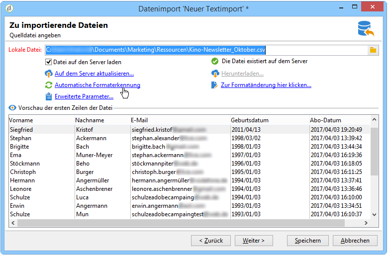

Verwenden Sie die oben in dieser Ansicht angebotenen Optionen, um den Import zu konfigurieren. Die über diese Optionen definierten Parameter werden in die Vorschau übertragen. Folgende Optionen stehen zur Verfügung:

* Die Option **[!UICONTROL Zur Formatänderung hier klicken...]** erlaubt die Überprüfung des Formats und eventuell seine Anpassung.
* **[!UICONTROL Auf dem Server aktualisieren...]** ermöglicht die Übertragung der lokalen Datei auf den Server. Diese Option ist nur verfügbar, wenn **[!UICONTROL Datei auf den Server hochladen]** ausgewählt ist.
* Die Option **[!UICONTROL Herunterladen]** ist nur verfügbar, wenn die Datei auf den Server geladen wurde.
* **[!UICONTROL Format automatisch erkennen]** wird verwendet, um das Format der Datenquelle neu zu initialisieren. Diese Option stellt das ursprüngliche Format von durch die Option **[!UICONTROL Zur Formatänderung hier klicken...]** formatierten Daten wieder her.
* Über **[!UICONTROL Link]** Erweiterte Parameter“ können Sie die Quelldaten filtern und auf erweiterte Optionen zugreifen. Auf diesem Bildschirm können Sie festlegen, dass nur ein Teil der Datei importiert werden soll. Sie können auch einen Filter definieren, um beispielsweise nur Benutzer vom Typ „Interessent“ oder „Kunde“ entsprechend dem Wert der entsprechenden Zeile zu importieren. Diese Optionen sollten nur von erfahrenen JavaScript-Benutzern verwendet werden.

### Dateiformat ändern {#changing-the-file-format}

Mit **[!UICONTROL Option Hier klicken, um das Dateiformat zu ändern…]** können Sie die Daten der Quelldatei formatieren, insbesondere das Spaltentrennzeichen und den Datentyp für jedes Feld angeben. Diese Konfiguration erfolgt über das folgende Fenster:

In diesem Schritt können Sie beschreiben, wie die Werte der Dateifelder gelesen werden sollen. Beispielsweise können bei einem Datum die Daten Datum oder Datum + Uhrzeit mit einem Format verknüpft werden (TT/MM/JJJJ, MM/TT/JJJ usw.). Wenn die Eingabedaten nicht dem erwarteten Format entsprechen, werden sie beim Import zurückgewiesen.

Das Ergebnis der Konfigurationen wird im unteren Teil des Fensters angezeigt.

Klicken Sie auf **[!UICONTROL OK]**, um die Formatierung zu speichern, und anschließend auf **[!UICONTROL Weiter]**.

### &#x200B;3. Schritt – Felder zuordnen {#step-3---field-mapping}

Wählen Sie nun das Zielschema aus und ordnen Sie die Quellfelder den Datenbankfeldern zu.

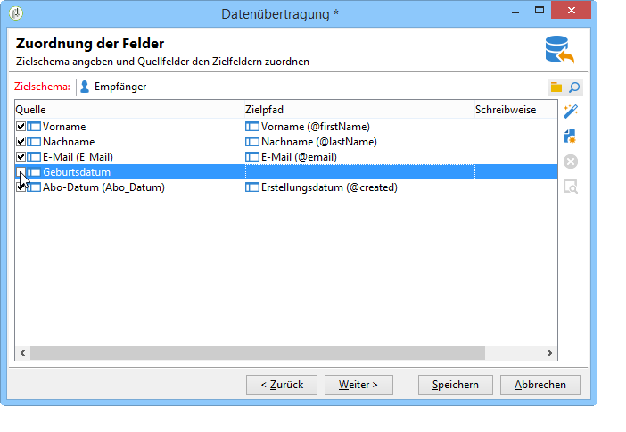

* Im Feld **[!UICONTROL Zielschema]** können Sie das Schema auswählen, in das die Daten importiert werden sollen. Diese Informationen sind obligatorisch. Klicken Sie auf das Symbol **[!UICONTROL Verknüpftes Element auswählen]**, um ein existierendes Schema auszuwählen. Klicken Sie auf **[!UICONTROL Verknüpftes Element öffnen]**, um die Struktur der zugrunde liegenden Tabelle anzusehen.
* Die zentrale Tabelle zeigt alle in der Quelldatei definierten Felder an. Wählen Sie die zu importierenden Felder aus, um ihnen eine Zieldatei zuzuordnen. Diese Felder können manuell oder automatisch zugeordnet werden.

  Kreuzen Sie für eine manuelle Zuordnung das gewünschte Quellfeld an und klicken Sie dann in die zweite Spalte, um die zugehörige Zelle zu aktivieren. Klicken Sie auf **[!UICONTROL Ausdruck bearbeiten]**, um alle verfügbaren Felder der Tabelle anzuzeigen. Wählen Sie das Zielfeld aus und bestätigen Sie die Zuordnung mit **[!UICONTROL OK]**.

  Um die Quellfelder und Zielfelder automatisch zu verknüpfen, klicken Sie auf **[!UICONTROL Erraten Sie die]**) rechts neben der Feldliste. Die vorgeschlagenen Felder können bei Bedarf geändert werden.

  >[!IMPORTANT]
  >
  >Prüfen Sie die ordnungsgemäße Zuordnung, bevor Sie zum nächsten Schritt übergehen.

* Es besteht die Möglichkeit, die Schreibweise der importierten Felder anzupassen. Klicken Sie hierfür in der Spalte **[!UICONTROL Schreibweise]** in die dem Feld entsprechende Zelle und wählen Sie die gewünschte Option aus.

  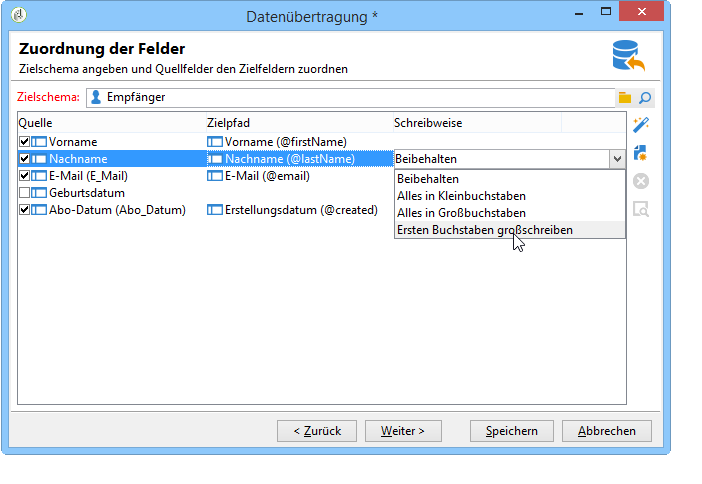

  >[!IMPORTANT]
  >
  >Die Umwandlung wird zum Zeitpunkt des Imports angewendet. Wenn jedoch Begrenzungen für das Zielfeld definiert wurden (im obigen Beispiel für das @lastname), haben diese Begrenzungen Vorrang.

* Sie können berechnete Felder mithilfe des entsprechenden Symbols rechts neben der zentralen Tabelle hinzufügen. Mit berechneten Feldern können Sie komplexe Umwandlungen durchführen, virtuelle Spalten hinzufügen oder die Daten mehrerer Spalten zusammenführen. Einzelheiten zu den verschiedenen Möglichkeiten finden Sie in den folgenden Abschnitten.

#### Berechnete Felder {#calculated-fields}

Berechnete Felder sind neue Spalten, die der Quelldatei hinzugefügt und aus anderen Spalten berechnet werden. Berechnete Felder können dann mit Feldern der Adobe Campaign-Datenbank verknüpft werden. Abstimmvorgänge sind jedoch für berechnete Felder nicht möglich.

Vier verschiedene Feldtypen stehen zur Verfügung:

* **[!UICONTROL Feste Zeichenfolge]**: Der Wert des berechneten Felds ist für alle Zeilen der Quelldatei gleich. Ermöglicht das Festlegen des Werts eines Felds der eingefügten oder aktualisierten Datensätze. Sie können beispielsweise für alle importierten Datensätze eine Markierung auf „Ja“ setzen.
* **[!UICONTROL Zeichenfolge mit JavaScript-Fusion]**: Das berechnete Feld kombiniert eine Zeichenfolge mit JavaScript-Direktiven.
* **[!UICONTROL JavaScript-]**: Der Wert des berechneten Felds ist das Ergebnis der Auswertung einer JavaScript-Funktion. Der zurückgegebene Wert kann eine Zahl, ein Datum usw. sein.
* **[!UICONTROL Auflistung]**: Der Wert des Felds wird anhand eines in der Quelldatei enthaltenen Werts zugewiesen. Mit dem Editor können Sie die Quellspalte angeben und die Liste der Auflistungswerte eingeben, wie im folgenden Beispiel:

  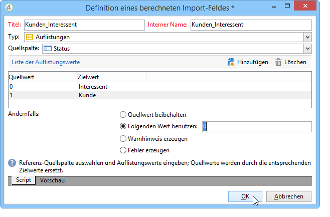

  Im **[!UICONTROL Vorschau]**-Tab können Sie das Ergebnis der Konfiguration ansehen. Im Beispiel wurde die Spalte **[!UICONTROL Abonnements]** hinzugefügt. Der Wert wird vom Feld **Status** ausgehend berechnet.

  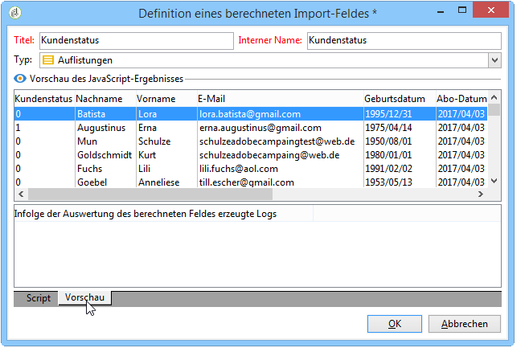

### &#x200B;4. Schritt – Datensätze abstimmen {#step-4---reconciliation}

Der Import-Assistent bietet die Möglichkeit, durch die Angabe von Abstimmkriterien die Art der Zusammenführung von importierten und existierenden Daten sowie Prioritätsregeln zu definieren. Das Konfigurationsfenster sieht wie folgt aus:

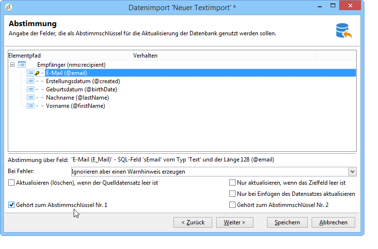

Der mittlere Bereich des dargestellten Bildschirms zeigt die Felder und Tabellen der Adobe Campaign-Datenbank an, in die die Daten importiert werden.

Für jeden Knoten (Tabelle oder Feld) stehen spezielle Optionen zur Verfügung. Wenn Sie auf den betreffenden Knoten in der Liste klicken, werden seine Parameter und eine kurze Beschreibung unten angezeigt. Für jedes Element werden in der Spalte **[!UICONTROL Verhalten]** die Auswirkungen der gewählten Optionen angegeben.

#### Vorgangstypen {#types-of-operation}

Für jede vom Import betroffene Tabelle muss die Art des Vorgangs definiert werden. Die folgenden Vorgänge sind für das Hauptelement der Datenbank verfügbar:

* **[!UICONTROL Aktualisieren oder einfügen]**: Aktualisiert Datensätze oder erstellt sie, falls sie noch nicht in der Datenbank existieren.
* **[!UICONTROL Einfügen]**: Erstellt neue Datensätze in der Datenbank.
* **[!UICONTROL Aktualisieren]**: Aktualisiert bestehende Datensätze, ignoriert alle anderen.
* **[!UICONTROL Nur Abstimmung]**: sucht in der Datenbank nach dem Datensatz, führt jedoch keine Aktualisierung durch. Beispielsweise können Sie den zu importierenden Empfängerordner anhand einer Spalte der Datei verknüpfen, ohne die Daten in den Ordnern zu aktualisieren.
* **[!UICONTROL Löschen]**: Löscht die Datensätze der Datenbank.

Für die Felder der vom Import betroffenen Tabellen stehen folgende Optionen zur Verfügung:

* **[!UICONTROL Aktualisieren (leer), wenn der Quellwert leer ist]**: Im Fall einer Aktualisierung entfernt der Wert im Feld den Datenbankwert, wenn das Feld in der Quelldatei leer ist. Andernfalls wird das Datenbankfeld beibehalten.
* **[!UICONTROL Nur aktualisieren, wenn das Ziel leer ist]**: Der Wert in der Quelldatei überschreibt den Wert im Datenbankfeld nur, wenn das Datenbankfeld leer ist. In diesem Fall nimmt er den Wert der Quelldatei.
* **[!UICONTROL Nur bei Einfügen des Datensatzes aktualisieren]**: Bei Aktualisierungs- oder Ergänzungsvorgängen werden nur die Datensätze der Quelldatei importiert, die neu in der Datenbank sind.

>[!NOTE]
>
>Außer bei einem Import ohne Deduplizierung ist die Angabe eines Abstimmschlüssels **zwingend erforderlich**.

#### Abstimmschlüssel {#reconciliation-keys}

Für die Deduplizierung ist die Angabe von mindestens einem Abstimmschlüssel erforderlich.

Ein Abstimmschlüssel ist ein Satz von Feldern, die zur Identifizierung eines Datensatzes verwendet werden. Um beispielsweise Empfänger zu importieren, kann der Abstimmschlüssel die Kontonummer, das Feld „E-Mail“ oder die Felder „Nachname, Vorname, Firma“ sein usw.

In diesem Fall vergleicht die Import-Engine die Werte der Datei mit denen der Datenbank für alle Schlüssel-Felder, um herauszufinden, ob eine Zeile einer Datei mit einem vorhandenen Empfänger in der Datenbank übereinstimmt. Wenn Felder für einen Datensatz spezifisch sind, kann ein feiner Vergleich zwischen den Quell- und Zieldaten durchgeführt werden, um die Integrität der Daten nach dem Import zu gewährleisten. Für dieselbe Tabelle kann ein zweiter Abstimmschlüssel ausgefüllt werden. Er wird für die Zeilen verwendet, deren erster Schlüssel leer ist.

Um die Erstellung doppelter Datensätze zu vermeiden, dürfen im Abstimmschlüssel keine Felder verwendet werden, die beim Import verändert werden könnten.

>[!NOTE]
>
>Bei einem Empfängerimport wird die Kennung des ausgewählten Ordners implizit zum Schlüssel hinzugefügt.
>
>Die Abstimmung wird daher nur für diesen Ordner durchgeführt (es sei denn, es ist kein Ordner ausgewählt).

#### Deduplizierung {#deduplication}

>[!NOTE]
>
>Eine Dublette ist ein Element, das mindestens zweimal in der zu importierenden Datei enthalten ist.
>
>Ein Duplikat ist ein Element, das sowohl in der Quelldatei als auch in der Datenbank enthalten ist.

Das Feld **[!UICONTROL Dublettenverwaltung]** dient der Konfiguration der Deduplizierung in Bezug auf Dubletten. Deduplizierung in Bezug auf Dubletten, d. h. Einträge, die wiederholt in der **Quelldatei** (oder den Quelldateien bei einem multiplen Import) vorkommen. Bei Dubletten sind die den Abstimmschlüssel bildenden Felder identisch.

* Die Duplikatverwaltung im **[!UICONTROL Update]**-Modus (Standardmodus) führt keine Deduplizierung durch. Der letzte Datensatz hat daher Priorität (da er die Daten der vorherigen Datensätze aktualisiert). In diesem Modus werden Duplikate nicht gezählt.
* Die Duplikatverwaltung im **[!UICONTROL Ignorieren]**-Modus oder **[!UICONTROL Ablehnungsentität]** schließt Duplikate vom Import aus. In diesem Fall wird kein Datensatz importiert.
* Im Modus **[!UICONTROL Entität zurückweisen]** werden die entsprechenden Datensätze nicht importiert und im Importprotokoll wird ein Fehler ausgewiesen.
* Im **[!UICONTROL Ignorieren]**-Modus wird das Element nicht importiert, aber es wird keine Spur des Fehlers beibehalten. In diesem Modus können Sie die Leistung optimieren.

>[!IMPORTANT]
>
>Die Deduplizierung erfolgt nur im Speicher. Der Umfang eines Imports mit Deduplizierung ist daher begrenzt. Die Beschränkung hängt von mehreren Parametern ab (Kapazität des Programm-Servers, Aktivität, Anzahl der Felder im Schlüssel usw.). Die maximale Größe für eine Deduplizierung liegt in der Größenordnung von 1.000.000 Zeilen.

Deduplizierung bezieht sich auf einen Datensatz, der sowohl in der Quelldatei als auch in der Datenbank vorhanden ist. Es kommt nur bei Importen mit Datenaktualisierung zum Tragen (**[!UICONTROL Aktualisieren und einfügen]** oder **[!UICONTROL Aktualisieren]**). Die Option **[!UICONTROL Duplikataverwaltung]** ermöglicht es, einen Datensatz entweder zu aktualisieren oder zu ignorieren, wenn er sowohl in der Quelldatei als auch der Datenbank vorkommt. Die Option **[!UICONTROL Je nach Herkunft aktualisieren oder hinzufügen]** ist Teil eines optionalen Moduls, sie steht im Standardkontext nicht zur Verfügung.

Die Optionen **[!UICONTROL Zurückweisen]** und **[!UICONTROL Ignorieren]** arbeiten auf die gleiche Weise wie zuvor beschrieben.

### Beim Auftreten von Fehlern {#behavior-in-the-event-of-an-error}

Bei den meisten Datenübertragungsvorgängen treten verschiedene Fehlertypen auf (inkohärentes Zeilenformat, ungültige E-Mail-Adresse usw.). Alle von der Import-Engine erzeugten Fehler und Warnungen werden gespeichert und mit der Importinstanz verknüpft.

Im Tab **[!UICONTROL Zurückweisungen]** können Details eingesehen werden.

Zurückweisungen können zwei verschiedenen, in der Spalte **[!UICONTROL Connector]** angezeigten Typen zugeordnet werden:

* Zurückweisungen des Text-Connectors betreffen Fehler, die während der Verarbeitung der Dateizeile auftreten (berechnetes Feld, Datenanalyse usw.). In diesem Fall wird bei einem Fehler immer die gesamte Zeile zurückgewiesen.
* Zurückweisungen des Datenbank-Connectors beziehen sich auf Fehler, die beim Abgleich der Daten oder beim Schreiben in die Datenbank auftreten. Bei einem Import in mehrere Tabellen kann die Zurückweisung nur einen Teil des Datensatzes betreffen (bei einem Import von Empfängern und zugehörigen Ereignissen kann beispielsweise ein Fehler die Aktualisierung eines Ereignisses verhindern, ohne den Empfänger abzulehnen).

Auf der Abstimmungsseite besteht die Möglichkeit, für jedes Feld und jede Tabelle gesondert den Umgang mit Fehlern festzulegen.

* **[!UICONTROL Ignorieren aber einen Warnhinweis erzeugen]**: Es werden alle Felder in die Datenbank importiert, ausgenommen das Feld, das den Fehler erzeugt hat.
* **[!UICONTROL Übergeordnetes Element zurückweisen]**: Die gesamte Zeile wird zurückgewiesen (nicht nur das den Fehler auslösende Feld).
* **[!UICONTROL Alle Elemente zurückweisen]**: Der Import wird gestoppt und alle Elemente des Datensatzes werden zurückgewiesen.

  

Der Navigationsbaum im Zurückweisungsbildschirm einer Importinstanz zeigt die zurückgewiesenen Felder und aufgetretene Fehler an.

Über das Symbol **[!UICONTROL Zurückweisungen exportieren]** können Sie eine Datei mit den entsprechenden Informationen erzeugen.

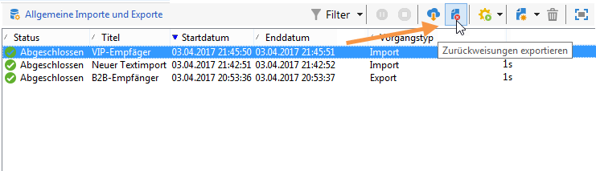

### Schritt 5 – Zusätzlicher Schritt beim Import von Empfängern {#step-5---additional-step-when-importing-recipients}

Der folgende Schritt im Import-Assistenten ermöglicht die Auswahl oder Erstellung eines Importordners, die automatische Zuordnung der importierten Empfangenden zu einer neuen oder existierenden Liste und ihre Anmeldung für Informationsdienste.

>[!NOTE]
>
>Dieser Schritt wird nur im Falle eines Empfängerimports und bei Verwendung der Standardempfängertabelle (**nms:recipient**) von Adobe Campaign angezeigt.

* Klicken Sie auf den **[!UICONTROL Bearbeiten]**-Link, um den Ordner, die Liste oder den Dienst auszuwählen, mit denen die Empfänger verknüpft werden sollen.

   1. In einem Ordner speichern

      Über den Link **[!UICONTROL Bearbeiten…]** des Abschnitts **[!UICONTROL In einen Ordner importieren]** können Sie den Ordner auswählen oder erstellen, in den die Empfänger importiert werden sollen. Wenn keine Partition definiert ist, werden die Daten standardmäßig in den Standardordner des Benutzers importiert.

      >[!NOTE]
      >
      >Der Standardordner des Benutzers entspricht dem ersten Ordner, für den der Benutzer Schreibzugriff hat. Weitere Informationen finden Sie unter [Verwalten von Ordnern und Ansichten](../audiences/folders-and-views.md).

      Klicken Sie zur Auswahl des Importordners auf den Pfeil rechts des **[!UICONTROL Ordner]**-Feldes und wählen Sie den gewünschten Ordner aus. Über das Symbol **[!UICONTROL Verknüpftes Element auswählen]** können Sie den Navigationsbaum in einem neuen Fenster anzeigen und einen neuen Ordner erstellen.

      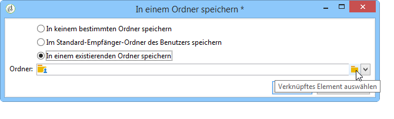

      Wählen Sie zur Erstellung eines neuen Ordners den Knoten aus, in den der Ordner eingefügt werden soll, und klicken Sie mit der rechten Maustaste. Wählen Sie **[!UICONTROL Empfänger-Ordner hinzufügen]**.

      

      Der Ordner wird als Unterordner des aktuellen Knotens eingefügt. Geben Sie den Namen des neuen Ordners an, drücken Sie zum Bestätigen die Enter-Taste und klicken Sie auf **[!UICONTROL OK]**.

      

   1. Einer Liste zuordnen

      Der **[!UICONTROL Bearbeiten...]**-Link der Option **[!UICONTROL Empfänger auf eine Liste setzen]** ermöglicht die Auswahl oder die Erstellung der Liste, zu der die Empfänger hinzugefügt werden sollen.

      

      Sie können eine neue Liste für diese Empfänger erstellen, indem Sie auf **[!UICONTROL Verknüpftes Element auswählen]** und dann auf **[!UICONTROL Erstellen]** klicken.

      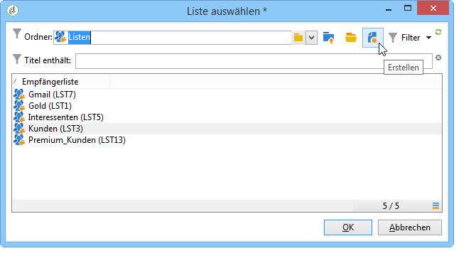

      Sie können die Empfänger zu den bereits in einer Liste vorhandenen hinzufügen oder die Liste mit den neuen Empfängern neu erstellen. Wenn die Liste bereits Empfänger enthält, werden diese gelöscht und durch die importierten Empfänger ersetzt.

   1. Anmeldung für einen Dienst

      Um alle importierten Empfänger für einen Informationsdienst anzumelden, klicken Sie auf den Link **[!UICONTROL Bearbeiten...]** der Option **[!UICONTROL Empfänger für einen Dienst anmelden]**, um den Informationsdienst auszuwählen oder zu erstellen, für den die Empfänger angemeldet werden sollen. Aktivieren Sie **[!UICONTROL Benachrichtigung versenden]**, wenn die Empfänger von der Anmeldung in Kenntnis gesetzt werden sollen. Der Benachrichtigungsinhalt wird in den die An- und Abmeldungen betreffenden Versandvorlagen bestimmt.

      

      Sie haben auch die Möglichkeit, einen neuen Informationsdienst für diese Empfängerinnen und Empfänger zu erstellen. Klicken Sie hierfür auf **[!UICONTROL Verknüpftes Element auswählen]** und dann auf das Symbol **[!UICONTROL Erstellen]**. Informationsdienste werden in [diesem Abschnitt](../start/subscriptions.md) näher erläutert.

* Verwenden Sie das Feld **[!UICONTROL Herkunft]**, um Informationen über die Herkunft von Empfängern zu ihren Profilen hinzuzufügen. Diese Informationen sind insbesondere im Rahmen eines Mehrfachimports nützlich.

Klicken Sie auf **[!UICONTROL Weiter]**, um die in diesem Schritt vorgenommenen Konfigurationen zu bestätigen.

### &#x200B;6. Schritt – Import starten {#step-6---launching-the-import}

Im letzten Schritt des Assistenten wird der Datenimport ausgelöst. Klicken Sie hierfür auf die Schaltfläche **[!UICONTROL Starten]**.

Anschließend können Sie die Ausführung des Importauftrages überwachen (siehe [Überwachen der Workflow-Ausführung](../../automation/workflow/monitor-workflow-execution.md)).

## Daten exportieren

Mit Exportaufträgen können Sie Daten aus der Datenbank aufrufen und extrahieren: Kontakte, Kundinnen und Kunden, Listen, Segmente usw.

Beispielsweise kann es nützlich sein, Tracking-Daten für Kampagnen zu verwenden (Tracking-Verlauf usw.) in einer Tabelle. Die Ausgabedaten können in den Formaten *.txt, *.csv, *.tab oder *.xml vorliegen.

Mit dem Export-Assistenten können Sie einen Export konfigurieren, seine Optionen definieren und die Ausführung starten. Es handelt sich dabei um eine Reihe von Bildschirmen, deren Inhalt von der Art des Exports (einfach oder mehrfach) und den Rechten des Benutzers abhängt.

Der Export-Assistent wird nach dem Erstellen eines neuen Exportauftrags angezeigt.

### &#x200B;1. Schritt – Exportvorlage auswählen {#step-1---choosing-the-export-template}

Beim Start des Export-Assistenten muss zunächst eine Vorlage ausgewählt werden. Um beispielsweise den Export von Empfangenden zu konfigurieren, die sich kürzlich angemeldet haben, gehen Sie folgendermaßen vor:

1. Gehen Sie zum Ordner **[!UICONTROL Profile und Zielgruppen > Auftrag > Allgemeine Importe und Exporte]**.
1. Wählen Sie **Neu** und danach **Exportieren** aus, um die Exportvorlage zu erstellen.

   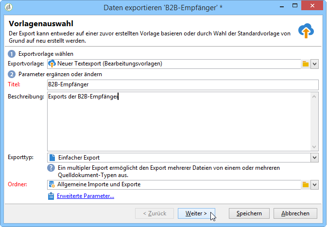

1. Klicken Sie zur Auswahl der gewünschten Vorlage rechts vom Feld **[!UICONTROL Exportvorlage]** entweder auf den Pfeil oder auf **[!UICONTROL Verknüpftes Element auswählen]**, um den Navigationsbaum zu durchsuchen.

   Die native Vorlage lautet **[!UICONTROL Neuer Textexport]**. Diese Vorlage darf nicht geändert werden. Sie können sie jedoch duplizieren, um eine neue Vorlage zu konfigurieren. Standardmäßig werden Exportvorlagen im Knoten **[!UICONTROL Ressourcen > Vorlagen > Bearbeitungsvorlagen]** gespeichert.

1. Geben Sie im Feld **[!UICONTROL Titel]** einen Namen für den Export ein. Sie können eine Beschreibung hinzufügen.
1. Wählen Sie den Exporttyp aus. Es gibt zwei mögliche Exporttypen: **[!UICONTROL Einfacher Export]**, um nur eine Datei zu exportieren, und **[!UICONTROL Mehrfacher Export]**, um mehrere Dateien in einer Ausführung zu exportieren, u. U. mit verschiedenen Quelldokumenttypen.

### &#x200B;2. Schritt – Dateityp zum exportieren auswählen {#step-2---type-of-file-to-export}

Wählen Sie den Typ des zu exportierenden Dokuments aus, d. h. das Schema der zu exportierenden Daten.

Bei einem vom Knoten **[!UICONTROL Vorgänge]** ausgehenden Export wird standardmäßig die Empfängertabelle vorgeschlagen. Wenn der Export von einer Liste ausgehend gestartet wird (durch **[!UICONTROL Rechtsklick > Export]**), wird der **[!UICONTROL Dokumenttyp]** in der Tabelle, zu der die Daten gehören, automatisch ausgefüllt.

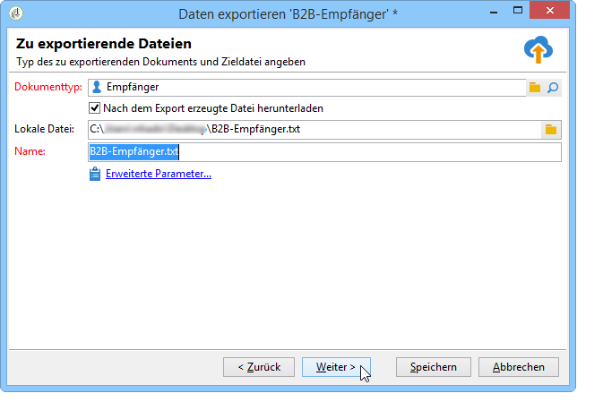

* Standardmäßig ist die Option **[!UICONTROL Nach dem Export erzeugte Datei herunterladen]** aktiviert: Geben Sie in diesem Fall den Namen der zu erstellenden Datei im Feld **[!UICONTROL Lokale Datei]** an oder durchsuchen Sie Ihre lokale Festplatte, indem Sie auf das Ordnersymbol rechts vom Feld klicken. Sie haben die Möglichkeit, diese Option abzuwählen und den Pfad und Namen der Ausgabedatei auf dem Server anzugeben.

  >[!NOTE]
  >
  >Automatische Im- und Exporte werden stets auf dem Server durchgeführt.
  >
  >Sollten Sie nur einen Teil der Daten exportieren wollen, klicken Sie auf **[!UICONTROL Erweiterte Parameter...]** und geben Sie die Anzahl der zu exportierenden Zeilen an.

* Sie können einen Differenzexport erstellen, um nur Einträge zu exportieren, die seit der letzten Ausführung geändert wurden. Klicken Sie hierfür auf **[!UICONTROL Erweiterte Parameter...]** und aktivieren Sie auf der Registerkarte **[!UICONTROL Differenzexport]** die Option **[!UICONTROL Differenzexport aktivieren]**.

  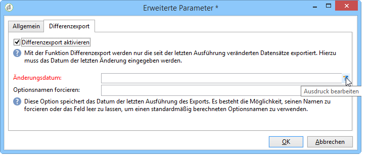

  Sie müssen das Datum der letzten Änderung eingeben. Sie kann aus einem Feld abgerufen oder berechnet werden.

### &#x200B;3. Schritt – Ausgabeformat bestimmen {#step-3---defining-the-output-format}

Wählen Sie ein Ausgabeformat für die Exportdatei aus. Die folgenden Formate können verwendet werden: Text, Text mit festen Spalten, CSV und XML.

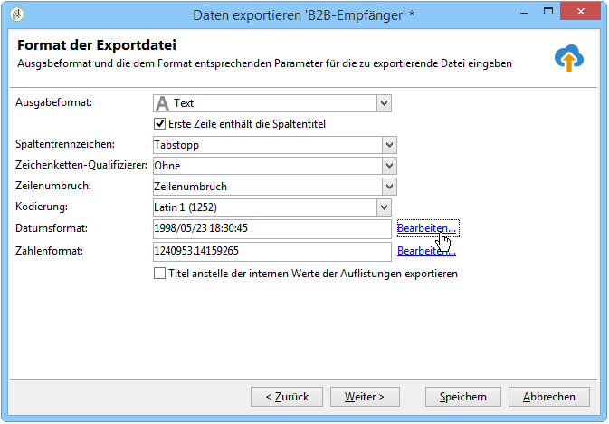

* Beim Format **[!UICONTROL Text]** sind die Spaltentrennzeichen (Tabstopp, Komma, Semikolon oder Sonstige) sowie die Zeichenfolgen-Qualifizierer (Ohne, Doppelte Anführungszeichen, Einfache Anführungszeichen) anzugeben.
* Bei den Formaten **[!UICONTROL Text]** und **[!UICONTROL CSV]** besteht die Möglichkeit, die Option **[!UICONTROL Erste Zeile enthält die Spaltentitel]** anzukreuzen.
* Geben Sie das Format von Datum und Zahl an. Klicken Sie dazu auf die Schaltfläche **[!UICONTROL Bearbeiten]** für das entsprechende Feld und verwenden Sie den Editor.
* Bei Feldern, die Aufzählungswerte enthalten, können Sie **[!UICONTROL Titel anstelle der internen Werte der Auflistungen exportieren]** auswählen. Beispielsweise kann der Titel in der Form gespeichert werden **1=Herr**, **2=**, **3=Frau**. Wenn diese Option ausgewählt ist **werden**, **Miss** und **Mrs.** exportiert.

### &#x200B;4. Schritt – Daten auswählen {#step-4---data-selection}

Auswahl der zu exportierenden Felder. Gehen Sie dazu wie folgt vor:

1. Wählen Sie per Doppelklick die gewünschten Felder in der Liste **[!UICONTROL Verfügbare Felder]** aus, um sie zum Bereich **[!UICONTROL Ausgabespalten]** hinzuzufügen.
1. Mit den Pfeilen rechts neben der Liste können Sie die Reihenfolge der Felder in der Ausgabedatei festlegen.

   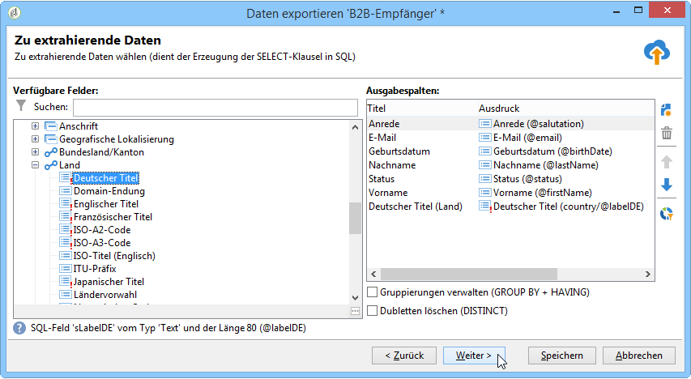

1. Klicken Sie auf die Schaltfläche **[!UICONTROL Hinzufügen]**, um Funktionen aufzurufen.

### &#x200B;5. Schritt – Spalten sortieren {#step-5---sorting-columns}

An dieser Stelle kann die Sortierreihenfolge der einzelnen Spalten festgelegt werden.

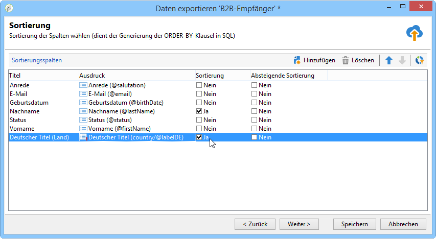

### &#x200B;6. Schritt – Filterbedingungen {#step-6---filter-conditions-}

Um nicht alle Datensätze zu exportieren, haben Sie die Möglichkeit, Filterbedingungen zu konfigurieren. Die Vorgehensweise entspricht der Zielgruppenbestimmung im Versandassistenten.

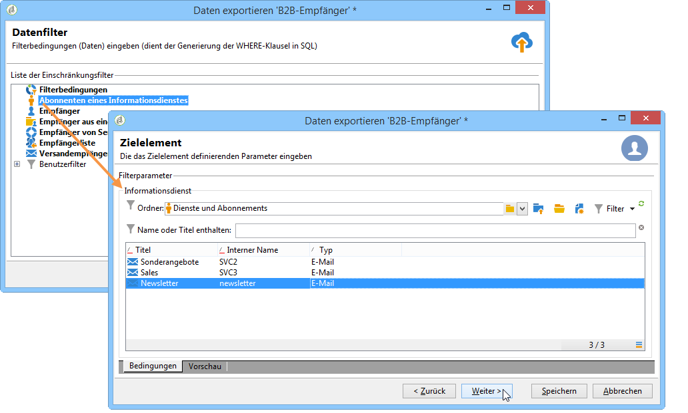

### &#x200B;7. Schritt – Daten formatieren {#step-7---data-formatting}

An dieser Stelle können die Reihenfolge der Spalten in der Ausgabedatei und ihre Titel festgelegt sowie die Schreibweise der Quelldaten angepasst werden.

* Die Reihenfolge der zu exportierenden Spalten lässt sich mithilfe der blauen Pfeile rechts von der Tabelle ändern.
* Um den Titel eines Felds zu ändern, klicken Sie in die Zelle der Spalte **[!UICONTROL Titel]**, die dem zu ändernden Feld entspricht, und geben Sie den neuen Titel ein. Drücken Sie zur Bestätigung die Eingabetaste auf der Tastatur.
* Um eine Groß-/Kleinschreibung auf den Inhalt eines Felds anzuwenden, wählen Sie diese aus der Spalte **[!UICONTROL Umwandlung]** aus. Sie können Folgendes auswählen:

   * Alles in Großbuchstaben
   * Alles in Kleinbuchstaben
   * Ersten Buchstaben großschreiben

  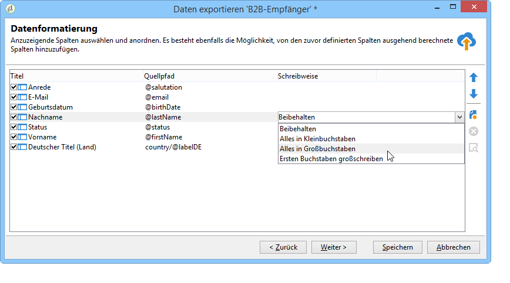

* Verwenden Sie die Schaltfläche **[!UICONTROL Berechnetes Feld hinzufügen]**, um eine neue Spalte zu erstellen (z. B. eine Spalte mit Vor- und Nachnamen). Weiterführende Informationen hierzu finden Sie im Abschnitt „Datenimport“.

Wenn Sie eine Sammlung von Elementen exportieren (beispielsweise Abonnements von Empfängerinnen und Empfängern, Listen, denen sie angehören usw.), müssen Sie angeben, wie viele Elemente der Sammlung exportiert werden sollen.

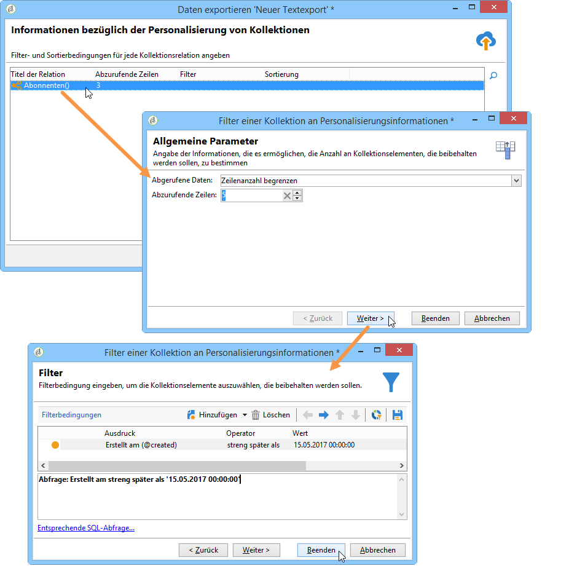

### &#x200B;8. Schritt – Datenvorschau {#step-8---data-preview}

Klicken Sie **[!UICONTROL Vorschau der Daten starten]** um eine Vorschau des Exportergebnisses anzuzeigen.

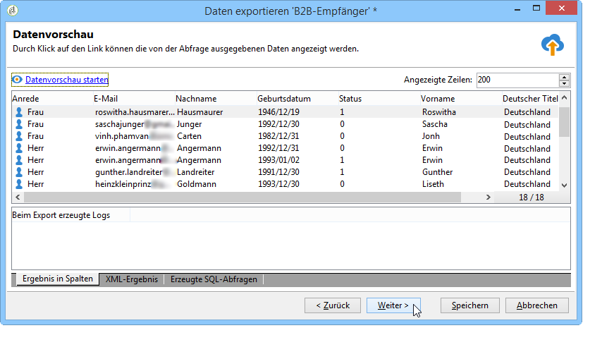

>[!NOTE]
>
>Wie bei allen in der Konsole verfügbaren Listen werden standardmäßig nur die ersten 200 Zeilen im Fenster **[!UICONTROL Datenvorschau“]**. Geben Sie eine Zahl in das Feld **[!UICONTROL Anzuzeigende Zeilen“ ein]** klicken Sie auf **[!UICONTROL Vorschau der Daten starten]**. [Weitere Informationen](../config/ui-settings.md#manage-and-customize-lists)

Durch Klick auf die Registerkarten unten im Fenster können Sie von der Ergebnisansicht in Spalten zur XML-Anzeige wechseln. Sie können außerdem die generierten SQL-Abfragen anzeigen.

### &#x200B;9. Schritt – Export starten {#step-9---launching-the-export}

Klicken Sie auf die Schaltfläche **[!UICONTROL Starten]**, um den Exportprozess zu beginnen.

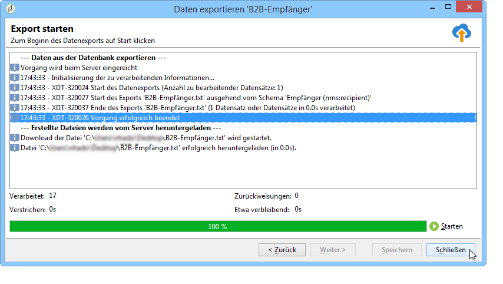

Anschließend können Sie die Ausführung des Importauftrages überwachen.

## Erfassen von Profilen über Web-Anwendungen

Verwenden Sie Campaign, um Web-Formulare zu erstellen und Profilinformationen einfach und effizient zu erfassen und zu verwalten. Sie können diese Formulare auf Ihrer Website freigeben, sodass Ihre Kontakte ihre Informationen einfach bereitstellen können. Ihre Informationen werden an Campaign gesendet, um ein Profil zu erstellen oder dessen Daten zu aktualisieren, sofern diese bereits in der Datenbank vorhanden sind.

In der [Dokumentation zu Campaign Classic v7](https://experienceleague.adobe.com/docs/campaign-classic/using/designing-content/web-forms/about-web-forms.html?lang=de){target="_blank"} erfahren Sie, wie Sie Web-Formulare erstellen.

**Verwandte Themen**

* [Zielgruppen erstellen](audiences.md)
* [Profile deduplizieren](../../automation/workflow/deduplication-merge.md)
* [Profildaten anreichern](../../automation/workflow/enrich-data.md)
* Grundlegendes zum [Datenmodell](../dev/datamodel.md) von Campaign