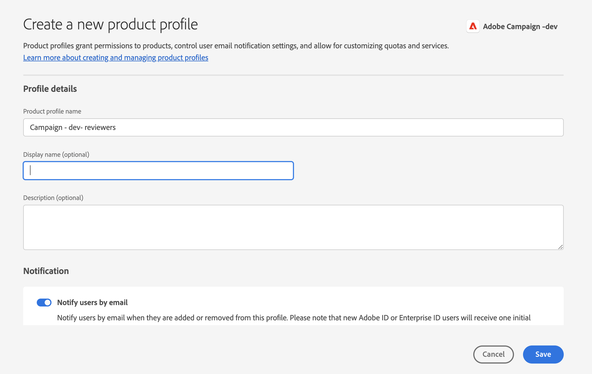

# Verwalten von Benutzerberechtigungen{#manage-permissions}

## Benutzer hinzufügen {#add-users}

Als Produktadministrator können Sie Benutzer hinzufügen und Zugriff auf Campaign gewähren.

Gehen Sie wie folgt vor, um einen Benutzer hinzuzufügen:

1. Im [Admin Console](https://adminconsole.adobe.com/enterprise)Startseite von {target=&quot;_blank&quot;} auswählen **Benutzer hinzufügen**.

   

1. Geben Sie die E-Mail-Adresse des Benutzers ein.
1. Verwenden Sie das Pluszeichen (+), um die Produktprofile oder Benutzergruppen auszuwählen, die dem Benutzer zugewiesen werden sollen.

   

   Die in Campaign integrierten Produktprofile werden im Abschnitt [diesem Abschnitt](#ootb-productprofiles).

   Erfahren Sie, wie Sie Benutzergruppen in erstellen [diesem Abschnitt](#user-groups)

1. Wählen Sie **Speichern** aus. Der Benutzer wird hinzugefügt und in der Liste &quot;Benutzer&quot;angezeigt. Wenn Sie Benutzern eine Administratorrolle oder ein Produktprofil zuweisen, erhalten diese eine E-Mail-Benachrichtigung. Benutzer müssen dem Link folgen, um ihr Profil auszufüllen.

Weitere Informationen zur Benutzererstellung finden Sie in der Admin Console unter [diese Seite](https://helpx.adobe.com/ie/enterprise/using/manage-users-individually.html){target=&quot;_blank&quot;}.

Wenn neue Benutzer [bei Campaign anmelden](connect.md) mit ihrer Adobe ID werden sie der Liste der Campaign-Benutzer in der Clientkonsole hinzugefügt. Kampagnenoperatoren werden im **[!UICONTROL Administration > Zugriffe > Benutzer]** Ordner des Campaign-Explorers.

## Arbeiten mit Produktprofilen{#product-profiles}

Verwenden Sie Produktprofile, um Benutzer mit den im Produkt enthaltenen Funktionen zu berechtigen.

* Für jedes Produkt auf der Admin Console können Sie ein oder mehrere Produktprofile erstellen.
* In jedem Produktprofil weisen Sie Benutzer und Benutzergruppen zu (in Ihrer Organisation).
* Wenn sich ein Benutzer mit seinen im Produktprofil angegebenen Anmeldeinformationen anmeldet, erhält er Zugriff auf die Apps und Dienste des Produkts, auf dem das Produktprofil basiert.

Diese Produktprofile stimmen mit den Benutzergruppen überein, die im **[!UICONTROL Administration > Zugriffe > Benutzergruppen]** Ordner des Campaign-Explorers.

In der Admin Console verwenden Produktprofile die folgende Syntax:

campaign - `<your instance>` - Interner Name der Benutzergruppe

Beispiel: für die **Versandverantwortlicher** -Gruppe in der Testinstanz bezeichnet, lautet das Produktprofil in der Admin Console:

campaign - test - delivery

Sie können Standardproduktprofile verwenden oder neue erstellen.

### Produktprofil erstellen{#create-product-profile}

Um ein neues Produktprofil zur Adobe hinzuzufügen, müssen Sie es zunächst in der Campaign-Clientkonsole erstellen und dann der Admin Console hinzufügen.

Gehen Sie wie folgt vor, um beispielsweise ein Produktprofil &quot;valiwers&quot;zu erstellen.

#### Benutzergruppe in Campaign erstellen{#create-op-group}

1. Verbindung zu Campaign herstellen, Explorer öffnen und navigieren Sie zu **[!UICONTROL Administration > Zugriffe > Benutzergruppen]**.
1. Klicken **[!UICONTROL Neu]**und legen Sie den Namen der Benutzergruppe fest und legen Sie deren internen Namen fest (&#39;valiviewers&#39;).
   
1. Definieren Sie die zugehörigen Berechtigungen durch Auswahl von spezifischen Berechtigungen. Spezifische Berechtigungen werden im Abschnitt [diesem Abschnitt](#use-named-rights)
1. Speichern Sie die neue Benutzergruppe.

#### Produktprofil in der Admin Console erstellen{#create-profile-in-admin-console}

1. Stellen Sie eine Verbindung zum [Admin Console](https://adminconsole.adobe.com/enterprise){target=&quot;_blank&quot;}.
1. Aus dem **Produkt und Dienstleistungen** auf der Startseite öffnen Sie das Campaign-Produkt.
1. Klicken **Neues Profil** und geben Sie den Namen des zu erstellenden Produktprofils mit der exakt korrekten Syntax wie beschrieben ein. [here](#product-profiles). In unserem Beispiel geben wir Folgendes ein: campaign - `<your-instance-name>` - validierungsverantwortliche Benutzer

   

1. Speichern Sie Ihre Änderungen.

Sie können jetzt Benutzer zu diesem neuen Produktprofil hinzufügen, wie hier beschrieben: [diesem Abschnitt](#add-users).

Es empfiehlt sich, Benutzergruppen Produktprofile zuzuweisen. Die Verwaltung von Berechtigungen durch Benutzer ist kein nachhaltiges Modell.

### Standardproduktprofile und Benutzergruppen {#ootb-productprofiles}

Adobe Campaign verfügt über integrierte Funktionen **Produktprofile** die definiert werden, wenn Adobe Ihre Umgebung aktiviert.

Diese Produktprofile stimmen mit Campaign überein **Benutzergruppen**. Standardbenutzergruppen und ihre [spezifische Berechtigungen](#use-named-rights) sind unten aufgeführt:

1. **[!UICONTROL Administrator]** (admin)

   Die Benutzer in dieser Gruppe haben vollen Zugriff auf die Instanz. Administratoren sind Benutzer, die auf die meisten technischen Bereiche der Benutzeroberfläche zugreifen können.

   Die Gruppe beinhaltet die folgende spezifische Berechtigung:

   * **[!UICONTROL ADMINISTRATION]**: Berechtigt zum Ausführen, Erstellen, Bearbeiten und Löschen von Objekten wie Workflows, Sendungen, Skripten usw.

1. **[!UICONTROL Versandverantwortliche Benutzer]** (delivery)

   Die Benutzer dieser Gruppe sind für die Versandverwaltung verantwortlich. Die Gruppe verleiht Zugriff auf die für die Erstellung und Vorbereitung von Sendungen notwendigen Hauptressourcen (Kampagnentypologien, Versandmappings, Standardvorlagen, Gestaltungsbausteine etc.).

   Die Gruppe beinhaltet folgende spezifische Berechtigungen:

   * **[!UICONTROL SENDUNGEN VORBEREITEN]**: Berechtigt zum Erstellen, Bearbeiten und Starten der Versandanalyse;
   * **[!UICONTROL SENDUNGEN STARTEN]**: Berechtigt zur Validierung von zuvor analysierten Sendungen.

1. **[!UICONTROL Kampagnenverantwortliche Benutzer]** (Vorgang)

   Die Benutzer dieser Gruppe können Marketing-Kampagnen verwalten. Diese Berechtigung verleiht Zugriff auf mit Kampagnen verbundene Elemente (Pläne, Programme, Workflows, Budgets etc.) im Rahmen von **[!UICONTROL Campaign]** (optionales Adobe Campaign-Modul).

   Die Gruppe beinhaltet folgende spezifische Berechtigungen:

   * **[!UICONTROL EINFÜGEN VON ORDNERN]**: Berechtigt zum Einfügen von Ordnern in den Adobe Campaign-Navigationsbaum (erfordert Schreibzugriff für betroffene Zweige);
   * **[!UICONTROL WORKFLOW]**: Berechtigt zur Nutzung von Workflows.

   >[!NOTE]
   >
   >Benutzer dieser Gruppe können keine Sendungen starten.

1. **[!UICONTROL Autoren]** (content)

   Benutzer dieser Gruppe können auf die Inhaltsordner im Kontext der **[!UICONTROL Content Management]** -Add-on. Diese Gruppe erteilt keine zusätzlichen Berechtigungen.

1. **[!UICONTROL Berichtzugriff]** (Bericht)

   Diese Gruppe sollte externen Benutzern vorbehalten bleiben, um auf die Versandberichte über eine [Webzugriff](../start/campaign-ui.md#web-browser).

1. **[!UICONTROL Workflow-Ausführung]** (Workflow)

   Die Gruppe **[!UICONTROL Workflow-Ausführung]** dient der Ausführungs- und Validierungskontrolle von Zielgruppen-Workflows. Die Benutzer dieser Gruppe verfügen automatisch über die spezifische Berechtigung WORKFLOW. Diese ist neben den Datenzugriffsrechten Vorraussetzung für alle Workflow-bezogenen Aktionen. Die Gruppe **[!UICONTROL Workflow-Ausführung]** verfügt standardmäßig über Lesezugriff auf die Standard-Ordner der Zielgruppen-Workflows und der Workflow-Vorlagen. Die Benutzer dieser Gruppen haben des Weiteren Lese- und Schreibzugriff auf den Ordner der ausstehenden Validierungen.

1. **[!UICONTROL Workflow-Supervisoren]** (workflowSupervisor)

   Benutzer dieser Gruppe verwalten Workflow-Genehmigungen und erhalten im Falle von Warnungen bezüglich Kampagnen-Workflows eine E-Mail-Benachrichtigung.

1. **Lokale/Zentrale Verwaltung** (zentral/lokal)

   Benutzer dieser Gruppe können **[!UICONTROL Dezentrales Marketing]** -Add-on.

1. **[!UICONTROL Angebotsverantwortliche Benutzer]** (Angebot)

   Die Benutzer dieser Gruppe können Angebote mithilfe des Interaction-Add-ons erstellen und verwalten. [Weitere Informationen](../interaction/interaction-operators.md).

   Die Gruppe beinhaltet folgende spezifische Berechtigungen:

   * **[!UICONTROL EINFÜGEN VON ORDNERN]**: Berechtigt zum Einfügen von Ordnern in den Adobe Campaign-Navigationsbaum (erfordert Schreibzugriff für betroffene Zweige);
   * **[!UICONTROL BEARBEITUNG VON ORDNERN]**: Berechtigt zum Ändern von Ordnereigenschaften wie interner Name, Titel, verknüpftes Bild, Reihenfolge der Unterordner usw.

   Angebotsverantwortliche Benutzer können folgende Aufgaben ausführen:

   * Änderung von **[!UICONTROL Design-Umgebungen]**;
   * Ansicht von **[!UICONTROL Live-Umgebungen]**;
   * Konfiguration von administrativen Funktionen (vordefinierte Platzierungen und Filter);
   * Erstellen und aktualisieren Sie Kategorien.
   * Erstellung und Änderung von Angeboten;
   * Konfiguration von Angebotseignungen;
   * Validierung von Angeboten.

   >[!NOTE]
   >
   >**Angebotsverantwortliche Benutzer** kann ein Angebot nur validieren, wenn kein Validierer angegeben oder in der Angebotsvorlage als Validierer festgelegt wurde.

   Berechtigungsmatrix des Angebotsmanagers pro Umgebung ist verfügbar in [diese Seite](../interaction/interaction-operators.md#recap-of-rights-according-to-operator).

## Arbeiten mit Benutzergruppen{#user-groups}

Sie können die Admin Console verwenden, um Benutzergruppen zu erstellen und ihnen Benutzer zuzuweisen.

Eine Benutzergruppe ist eine Sammlung verschiedener Benutzer, denen ein freigegebener Berechtigungssatz erteilt werden muss. Erfahren Sie, wie Sie Benutzergruppen in erstellen [diesem Abschnitt](https://helpx.adobe.com/ie/enterprise/using/user-groups.html){target=&quot;_blank&quot;}.

Sie können Benutzergruppen Produktprofile zuweisen. Alle Benutzer in dieser Gruppe erhalten also dieselben Produktberechtigungen.

## Spezifische Berechtigungen{#use-named-rights}

Adobe Campaign verfügt über eine Reihe von spezifischen Berechtigungen, mit denen Sie die den Benutzern und Benutzergruppen zugewiesenen Berechtigungen definieren können. Diese Berechtigungen können über die **[!UICONTROL Administration > Zugriffe > Spezifische Berechtigungen]** Ordner des Campaign-Explorers.

Spezifische Berechtigungen gewähren Berechtigungen für:

* Vorgänge ausführen
Zum Beispiel ist die Schaltfläche **Analysieren** im Versand-Editor für Mitglieder der Gruppe **Versandoperatoren** aktiviert, die die spezifische Berechtigung **Versand vorbereiten** besitzen.

* Zugriff auf Ordner
Mitglieder von Operatorgruppen können Zugriffsrechte auf Ordner gewähren oder einschränken, indem sie die Sicherheitseinstellungen von Ordnern ändern. [Weitere Informationen](folder-permissions.md#restrict-access-to-a-folder).

   Zum Beispiel kann es diese Auswirkungen haben: **Schreibzugriff** zum Erstellen neuer Entitäten (wie Sendungen, Profile usw.), **Lesezugriff** zum Verwenden von Entitäten, **Löschzugriff** zum Löschen von Entitäten.

Standardspezifische Berechtigungen in Adobe Campaign sind:

* **[!UICONTROL ADMINISTRATION]**: Benutzer mit **[!UICONTROL ADMINISTRATORRECHTEN]** haben vollen Zugriff auf die Instanz. Administratoren können Objekte wie Workflows, Sendungen, Skripte usw. ausführen, erstellen, bearbeiten und löschen.

* **[!UICONTROL VALIDIERUNGSADMINISTRATION]**: Sie können verschiedene Validierungsschritte innerhalb von Workflows und Sendungen festlegen, um sicherzustellen, dass der aktuelle Status durch einen zugewiesenen Benutzer oder eine zugewiesene Gruppe validiert wurde. Benutzer mit der Berechtigung **[!UICONTROL VALIDIERUNGSADMINISTRATION]** können Validierungsschritte festlegen und auch einen Benutzer oder eine Benutzergruppe zuweisen, der bzw. die diese Schritte validieren soll.

* **[!UICONTROL ZENTRAL]**: Berechtigt zur zentralen Verwaltung (Dezentrales Marketing).

* **[!UICONTROL LÖSCHEN VON ORDNERN]**: Berechtigt zum Löschen von Ordnern. Mit dieser Berechtigung können Benutzer Ordner aus der Explorer-Ansicht löschen.

* **[!UICONTROL BEARBEITUNG VON ORDNERN]**: Berechtigt zum Ändern von Ordnereigenschaften wie interner Name, Titel, verknüpftes Bild, Reihenfolge der Unterordner usw.

* **[!UICONTROL EXPORTIEREN]**: Mit der Workflow-Aktivität **[!UICONTROL EXPORTIEREN]** können Benutzer Daten aus ihren Adobe Campaign-Instanzen in eine Datei auf einem Server oder lokalen Computer exportieren.

* **[!UICONTROL ZUGRIFF AUF DATEIEN]**: Berechtigung für Lese- und Schreibzugriff auf Dateien über ein Skript, das in die **[!UICONTROL JavaScript]**-Workflow-Aktivität geschrieben werden kann, um Dateien auf einem Server zu lesen und zu schreiben.

* **[!UICONTROL ALLGEMEINER IMPORT]**: Berechtigt zum allgemeinen Import von Daten. Mit **[!UICONTROL ALLGEMEINER IMPORT]** können Sie Daten in eine andere Tabelle importieren, während die Berechtigung **[!UICONTROL BERECHTIGT ZUM IMPORT VON EMPFÄNGERN]** nur den Import in die Empfängertabelle erlaubt.

* **[!UICONTROL EINFÜGEN VON ORDNERN]**: Berechtigt zum Einfügen von Ordnern. Benutzer mit der Berechtigung **[!UICONTROL EINFÜGEN VON ORDNERN]** können in der Ordnerstruktur der Explorer-Ansicht neue Ordner erstellen.

* **[!UICONTROL LOKAL]**: Berechtigt zur lokalen Verwaltung (Dezentrales Marketing).

* **[!UICONTROL FUSION]**: Berechtigt zum Verbinden der ausgewählten Datensätze zu einem Datensatz. Wenn Empfänger als Duplikate vorhanden sind, kann der Benutzer mit der Berechtigung **[!UICONTROL FUSION]** die Duplikate auswählen und zu einem primären Empfänger vereinen.

* **[!UICONTROL SENDUNGEN VORBEREITEN]**: Berechtigung zum Erstellen, Bearbeiten und Speichern einer Sendung. Benutzer mit der Berechtigung **[!UICONTROL SENDUNGEN VORBEREITEN]** können auch den Prozess der Versandanalyse starten.

* **[!UICONTROL DATENSCHUTZRECHT]**: Berechtigt dazu, Datenschutzdaten zu sammeln und zu löschen. [Weitere Informationen](privacy.md).

* **[!UICONTROL AUSFÜHRUNG VON PROGRAMMEN]**: Berechtigt dazu, Befehle in verschiedenen Programmiersprachen auszuführen.

* **[!UICONTROL IMPORT VON EMPFÄNGERN]**: Berechtigt zum Import von Empfängern. Benutzer mit der Berechtigung **[!UICONTROL IMPORT VON EMPFÄNGERN]** können eine lokale Datei in eine Empfängertabelle importieren.

* **[!UICONTROL AUSFÜHRUNG VON SQL-SCRIPTS]**: Berechtigt zur Ausführung von SQL-Befehlen direkt in der Datenbank.

* **[!UICONTROL SENDUNGEN STARTEN]**: Berechtigt zur Validierung von zuvor analysierten Sendungen. Nach der Versandanalyse wird der Versand bei verschiedenen Validierungsschritten angehalten und muss validiert werden, damit er wieder aufgenommen werden kann. Benutzer mit der Berechtigung **[!UICONTROL SENDUNGEN STARTEN]** können Sendungen validieren.

* **[!UICONTROL SQL-DATENVERWALTUNGSAKTIVITÄT VERWENDEN]**: Berechtigung zum Schreiben eigener SQL-Skripte mithilfe der SQL Data Management-Aktivität zum Erstellen und Ausfüllen von Arbeitstabellen. [Weitere Informationen](../../automation/workflow/sql-data-management.md).

* **[!UICONTROL WORKFLOW]**: Diese spezifische Berechtigung gilt für Workflows: Damit können Sie Workflows erstellen, starten und stoppen. Leserechte für die Workflow-Datei sind erforderlich, damit die spezifische Berechtigung angewendet werden kann. Bei Zielgruppen-Workflows die Leseberechtigung auf der **[!UICONTROL Profile und Zielgruppen]** -Ordner erforderlich ist.

* **[!UICONTROL WEBAPP]**: Berechtigt zur Nutzung von Web-Anwendungen.

>[!NOTE]
>
>Diese Liste kann je nach den in Ihrer Umgebung installierten Add-ons unterschiedlich sein.

## Zusätzliche Ressourcen{#additional-res}

* [Berechtigungen für Workflows verwalten](../../automation/workflow/managing-rights.md)
* [Berechtigungen für verteiltes Marketing verwalten](../../automation/distributed-marketing/about-distributed-marketing.md#operators)
* [Berechtigungen für das Interaktionsmodul verwalten](../interaction/interaction-operators.md)
* [Filterzugriff auf Schemata](../dev/filter-schema.md)
* [Einschränken der Anzeige von personenbezogenen Daten](../dev/restrict-pi-view.md)
