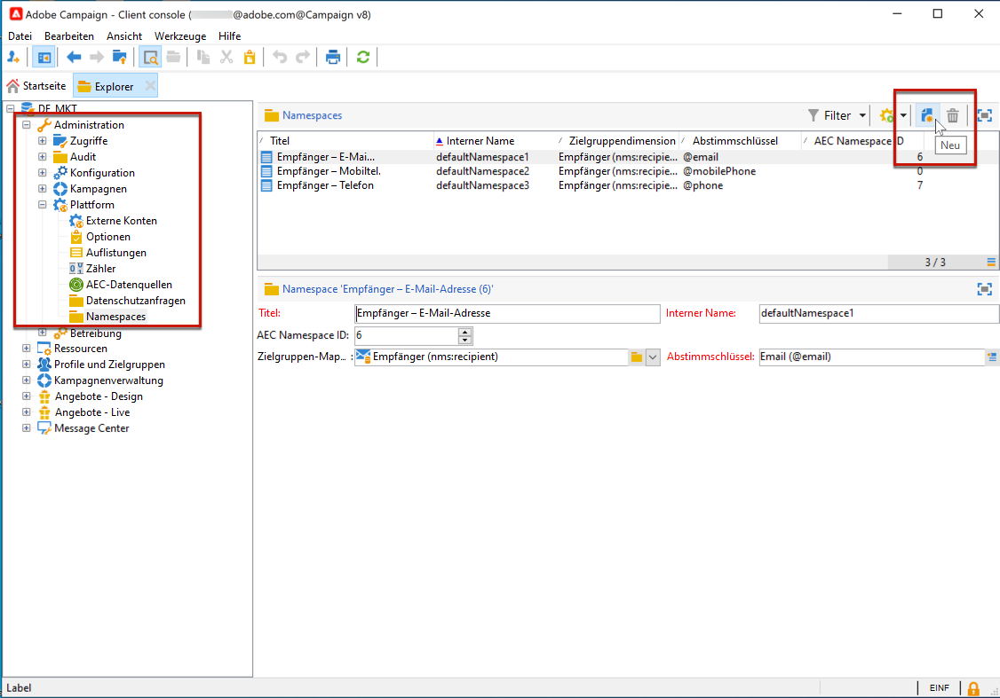
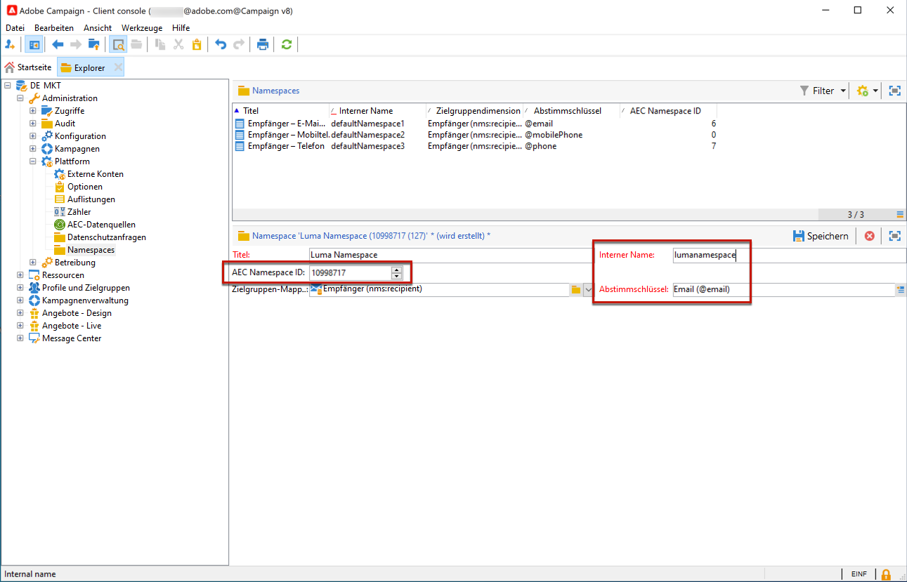

# Verwalten von Datenschutzanfragen in Campaign {#privacy}

<!--Adobe Campaign is a powerful tool for collecting and processing large volume of data, including personal information and sensitive data. It is therefore essential that you receive and monitor consent from your recipients.-->

>[!NOTE]
>
>Diese Funktion ist ab Campaign v8.3 verfügbar. Informationen zur Prüfung Ihrer Version finden Sie unter [diesem Abschnitt](compatibility-matrix.md#how-to-check-your-campaign-version-and-buildversion)

Um Sie bei der Einhaltung der Datenschutzverordnungen zu unterstützen, ermöglicht Ihnen Adobe Campaign die Durchführung von Zugriffs- und Löschanfragen.

 Erfahren Sie mehr über die **Recht auf Zugriff** und **Recht auf Vergessenwerden** (Löschanfrage) in [Dokumentation zu Adobe Campaign Classic v7](https://experienceleague.adobe.com/docs/campaign-classic/using/getting-started/privacy/privacy-management.html#right-access-forgotten){target=&quot;_blank&quot;}.

Um diese Anfragen auszuführen, müssen Sie die Integration des **Privacy Core Service** verwenden. Die vom Privacy Core Service an alle Experience Cloud-Lösungen übertragenen Datenschutzanfragen werden von Campaign mithilfe eines speziellen Workflows automatisch verarbeitet. [Weitere Informationen](#create-privacy-request)

Adobe bietet Datenverantwortlichen die Werkzeuge zum Erstellen und Verarbeiten von Datenschutzanfragen für in Campaign gespeicherte Daten. Es liegt jedoch in Ihrer Verantwortung als Datenverantwortlicher, die Identität des Datensubjekts zu überprüfen, das die Anfrage stellt, und zu bestätigen, dass es sich bei den an den Anforderer zurückgegebenen Daten um das Datensubjekt handelt. Erfahren Sie mehr über personenbezogene Daten und die verschiedenen Einheiten, die Daten in verwalten [Dokumentation zu Adobe Campaign Classic v7](https://experienceleague.adobe.com/docs/campaign-classic/using/getting-started/privacy/privacy-and-recommendations.html#personal-data){target=&quot;_blank&quot;}.

## Namespace definieren {#namespaces}

Bevor Sie eine Datenschutzanfrage erstellen, müssen Sie **Namespace definieren** verwenden. Der Namespace ist der Schlüssel, anhand dessen die Identität der betroffenen Person in der Adobe Campaign-Datenbank identifiziert wird.

>[!NOTE]
>
>Weitere Informationen zu Identitäts-Namespaces finden Sie unter [Dokumentation zur Experience Platform](https://experienceleague.adobe.com/docs/experience-platform/identity/namespaces.html){target=&quot;_blank&quot;}.

Derzeit unterstützt Adobe Campaign nicht den Import von Namespaces aus dem Identity-Namespace-Dienst der Experience Platform. Nachdem Sie einen Namespace im Identity-Namespace-Dienst erstellt haben, müssen Sie den entsprechenden Namespace in der Adobe Campaign-Benutzeroberfläche manuell erstellen. Gehen Sie dazu wie folgt vor:

<!--v7?
Three namespaces are available out-of-the-box: email, phone and mobile phone. If you need a different namespace (a recipient custom field, for example), you can create a new one from **[!UICONTROL Administration]** > **[!UICONTROL Platform]** > **[!UICONTROL Namespaces]**.

>[!NOTE]
>
>For optimal performance, it is recommended to use out-of-the-box namespaces.
-->

1. Erstellen Sie einen Namespace im [Identity Namespace-Dienst](https://developer.adobe.com/experience-platform-apis/references/identity-service/#tag/Identity-Namespace){target=&quot;_blank&quot;}.

1. Wann [Auflisten der Identitäts-Namespaces](https://developer.adobe.com/experience-platform-apis/references/identity-service/#operation/getIdNamespaces){target=&quot;_blank&quot;} für Ihr Unternehmen verfügbar ist, erhalten Sie den Namespace beispielsweise die folgenden Details:

   ```
   {
           "updateTime": 1632903236731,
           "code": "lumanamespace",
           "status": "ACTIVE",
           "description": "new namespace for Luma privacy requests",
           "id": 10998717,
           "createTime": 1632903236731,
           "idType": "Email",
           "namespaceType": "Custom",
           "name": "Luma Namespace",
           "custom": true
   }
   ```

1. Navigieren Sie in Adobe Campaign zu **[!UICONTROL Administration]** > **[!UICONTROL Plattform]** > **[!UICONTROL Namespaces]** und wählen Sie **[!UICONTROL Neu]**.

   

1. Geben Sie einen **[!UICONTROL Titel]** ein.

1. Füllen Sie die neuen Namespace-Details entsprechend dem Namespace aus, den Sie im Identity Namespace-Dienst erstellt haben:

   * die **[!UICONTROL AEC-Namespace-ID]** muss mit dem Attribut &quot;id&quot; übereinstimmen;
   * die **[!UICONTROL Interner Name]** muss mit dem Attribut &quot;code&quot; übereinstimmen;
   * die **[!UICONTROL Abstimmschlüssel]** muss mit dem Attribut &quot;idType&quot;übereinstimmen.

   

   Die **[!UICONTROL Abstimmschlüssel]** wird verwendet, um die betroffene Person in der Adobe Campaign-Datenbank zu identifizieren.

1. Zielgruppen-Mapping wählen <!--(**[!UICONTROL Recipients]**, **[!UICONTROL Real time event]** or **[!UICONTROL Subscriptions]**)--> um anzugeben, wie der Namespace in Adobe Campaign abgestimmt werden soll.

   >[!NOTE]
   >
   >    Wenn Sie mehrere Zielgruppen-Mappings verwenden möchten, müssen Sie pro Zielgruppen-Mapping einen Namespace erstellen.

1. Speichern Sie Ihre Änderungen.

Jetzt können Sie Datenschutzanfragen basierend auf Ihrem neuen Namespace erstellen. Wenn Sie mehrere Namespaces verwenden, erstellen Sie für denselben Abstimmwert eine Datenschutzanfrage pro Namespace.

## Erstellen einer Datenschutzanfrage {#create-privacy-request}

Die **Privacy Core Service** Durch die -Integration können Sie Ihre Datenschutzanfragen in einem Kontext mit mehreren Lösungen über einen einzigen JSON-API-Aufruf automatisieren. Adobe Campaign verarbeitet die vom Privacy Core Service über einen speziellen Workflow übertragenen Anfragen automatisch.

>[!CAUTION]
>
>Damit die Datenschutzanfragen verarbeitet werden können, müssen Sie auf Ihrer Adobe Campaign-Instanz einen Namespace erstellen, der dem Namespace entspricht, den Sie im Identity-Namespace-Dienst der Experience Platform erstellt haben.

Siehe Abschnitt [Experience Platform Privacy Service](https://experienceleague.adobe.com/docs/experience-platform/privacy/home.html?lang=de)Dokumentation zu {target=&quot;_blank&quot;} , um zu erfahren, wie Sie Datenschutzanfragen aus dem Privacy Core Service erstellen.

Jeder Privacy Core Service-Auftrag wird in mehrere Datenschutzanfragen in Adobe Campaign aufgeteilt, je nachdem, wie viele Namespaces verwendet werden, wobei eine Anfrage einem Namespace entspricht.

Außerdem kann ein Vorgang in mehreren Instanzen ausgeführt werden. Daher werden für einen Vorgang mehrere Dateien erstellt. Wenn sich eine Anfrage beispielsweise auf zwei Namespaces bezieht und drei Instanzen betrifft, werden insgesamt sechs Dateien gesendet. Eine Datei pro Namespace und Instanz.

Der Dateiname setzt sich folgendermaßen zusammen: `<InstanceName>-<NamespaceId>-<ReconciliationKey>.xml`.

* **InstanceName**: der Name der Campaign-Instanz
* **NamespaceId**: die Namespace-Kennung des Identity Service für den verwendeten Namespace
* **Abstimmschlüssel**: verschlüsselter Abstimmschlüssel

>[!CAUTION]
>
>Um eine Anfrage mit dem benutzerdefinierten Namespace-Typ zu senden, nutzen Sie die [JSON-Methode](https://experienceleague.adobe.com/docs/experience-platform/privacy/ui/user-guide.html?lang=de#json){target=&quot;_blank&quot;} und fügen Sie die namespaceId zur Anforderung hinzu. Alternativ können Sie den [API-Aufruf](https://experienceleague.adobe.com/docs/experience-platform/privacy/api/privacy-jobs.html?lang=de#access-delete){target=&quot;_blank&quot;} für die Anfrage verwenden.
>
>Verwenden Sie nur die [Datenschutz-Benutzeroberfläche](https://experienceleague.adobe.com/docs/experience-platform/privacy/ui/user-guide.html?lang=de#request-builder){target=&quot;_blank&quot;} zum Senden von Anfragen mithilfe des standardmäßigen Namespace-Typs.

### Bei der Verarbeitung von Anforderungen durchsuchte Tabellen {#list-of-tables}

Bei der Durchführung einer Lösch- oder Zugriffsanfrage durchsucht Adobe Campaign alle Daten der betroffenen Person auf der Basis des **[!UICONTROL Abstimmwerts]**. Gesucht wird in allen Tabellen, in denen eine Relation mit der Tabelle des Empfängers besteht (vom Typ &quot;own&quot;).

Dies sind die Tabellen, die bei der Durchführung von Datenschutzanfragen standardmäßig berücksichtigt werden:

* Empfänger (recipient)
* Versandlog eines Empfängers (broadLogRcp)
* Trackinglogs der Empfänger (trackingLogRcp)
* Versandlog eines Ereignisses mit Verlauf (broadLogEventHisto)
* Inhalte der Empfängerlisten (rcpGrpRel)
* Angebotsvorschlag für einen Besucher (propositionVisitor)
* Besucher (visitor)
* Abonnementverlauf (subHisto)
* Abonnements (subscription)
* Angebotsvorschlag für einen Empfänger (propositionRcp)

Wenn Sie benutzerdefinierte Tabellen erstellt haben, für die eine Relation zur Empfängertabelle (Typ &quot;own&quot;) besteht, werden auch diese berücksichtigt. Wenn Sie beispielsweise eine Transaktionen-Tabelle haben, für die eine Relation mit der Empfängertabelle vorhanden ist, und eine Transaktionendetails-Tabelle, für die eine Relation mit der Transaktionen-Tabelle besteht, werden beide berücksichtigt.
<!--
>[!CAUTION]
>
>If you perform Privacy batch requests using profile deletion workflows, please take into consideration the following remarks:
>* Profile deletion via workflows do not process children tables.
>* You need to handle the deletion for all the children tables.
>* Adobe recommends that you create an ETL workflow that add the lines to delete in the Privacy Access table and let the **[!UICONTROL Delete privacy requests data]** workflow perform the deletion. We suggest to limit to 200 profiles per day to delete for performance reasons.-->

### Status von Datenschutzanfragen {#privacy-request-statuses}

Hier finden Sie die verschiedenen Status für Datenschutzanfragen in Adobe Campaign:

* **[!UICONTROL Neu]** / **[!UICONTROL Erneuter Versuch steht aus]**: Durchführung läuft, der Workflow hat die Anfrage noch nicht verarbeitet.
* **[!UICONTROL Verarbeitungsvorgang läuft]** / **[!UICONTROL Erneuter Versuch läuft]**: Der Workflow verarbeitet gerade die Anfrage.
* **[!UICONTROL Löschen steht aus]**: Der Workflow hat alle zu löschenden Empfängerdaten identifiziert.
* **[!UICONTROL Löschvorgang läuft]**: Der Workflow führt gerade die Löschung durch.
* **[!UICONTROL Beendet]**: Die Verarbeitung der Anfrage wurde ohne Fehler abgeschlossen.
* **[!UICONTROL Fehler]**: Workflow ist fehlerhaft. Die Spalte **[!UICONTROL Anfragestatus]** in der Liste der Datenschutzanfragen zeigt den Grund an. Beispielsweise bedeutet **[!UICONTROL Fehlerdaten nicht gefunden]**, dass in der Datenbank keine Empfängerdaten gefunden wurden, die dem **[!UICONTROL Abstimmwert]** der betroffenen Person entsprechen.

**Verwandte Themen** in der Dokumentation zu Campaign Classic v7:

* [Datenschutz und Einverständniserklärung](https://experienceleague.adobe.com/docs/campaign-classic/using/getting-started/privacy/privacy-and-recommendations.html){target=&quot;_blank&quot;}

* [Erste Schritte mit der Datenschutzverwaltung](https://experienceleague.adobe.com/docs/campaign-classic/using/getting-started/privacy/privacy-management.html){target=&quot;_blank&quot;}

* [Verordnungen zur Datenschutzverwaltung](https://experienceleague.adobe.com/docs/campaign-classic/using/getting-started/privacy/privacy-management.html#privacy-management-regulations){target=&quot;_blank&quot;} (DSGVO, CCPA, PDPA und LGPD)

* [Opt-out aus dem Verkauf von personenbezogenen Daten](https://experienceleague.adobe.com/docs/campaign-classic/using/getting-started/privacy/privacy-requests/privacy-requests-ccpa.html){target=&quot;_blank&quot;} (CCPA-spezifisch)