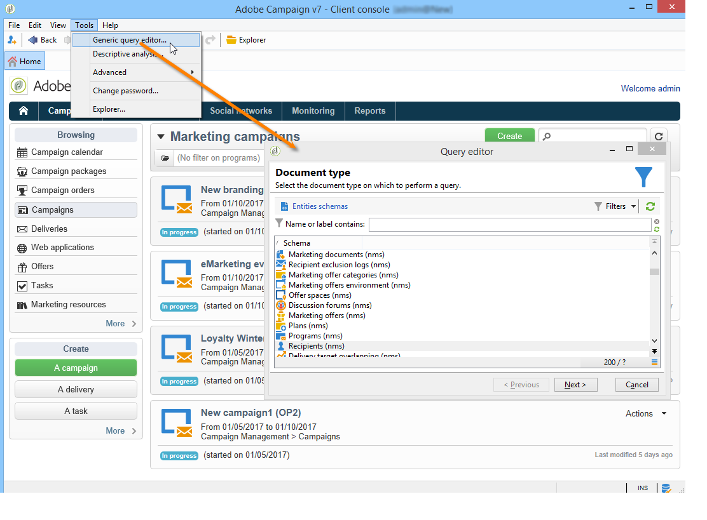
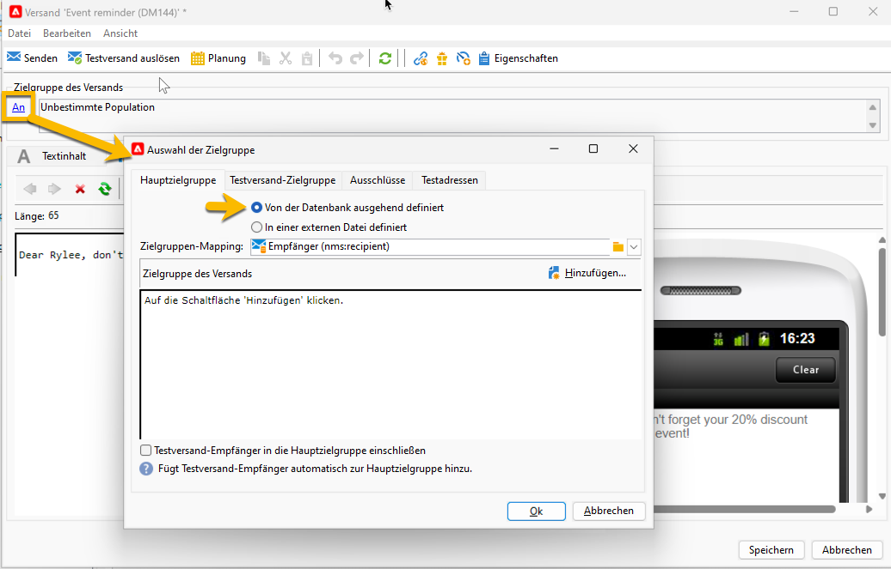
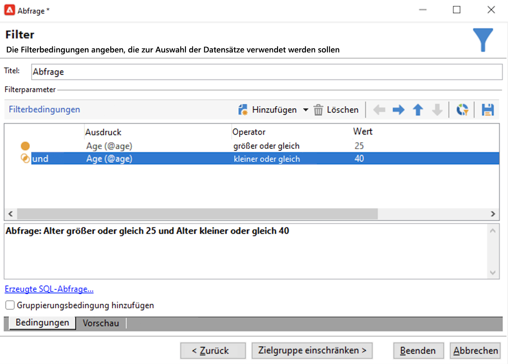

# Campaign-Datenbank abfragen

Das Abfragetool ist auf verschiedenen Anwendungsebenen verfügbar und kann verwendet werden, um Zielgruppen zu definieren, Kundschaft zu segmentieren, Trackinglogs zu extrahieren und zu filtern, Filter zu erstellen und vieles mehr.

Es bietet einen speziellen Assistenten – das generische Abfragetool –, das Sie im Menü **[!UICONTROL Tools > Generisches Abfragetool…]** aufrufen können. Dieses Tool ermöglicht Datenbankabfragen zum Extrahieren, Organisieren, Gruppieren und Sortieren von Informationen. Beispielsweise können Sie Empfangende abrufen, die in einem bestimmten Zeitraum mehr als n-mal auf einen Newsletter-Link geklickt haben.

Das generische Abfragetool zentralisiert alle Abfragefunktionen. Es ermöglicht die Erstellung und Speicherung von Einschränkungsfiltern, die dann in anderen Kontexten wiederverwendet werden können, z. B. im Abfragefeld eines Zielgruppen-Workflows.

Die Schritte zum Erstellen einer Abfrage werden [auf dieser Seite) &#x200B;](design-queries.md).

<!--
Contexts to use the query editor iin Campaign are listed below:

|Usage|Example|
|  ---  |  ---  |
|**Define a Query activity in a workflow**: Define the criteria to query Campaign database in a workflow. [Learn how to configure the Query activity](../../automation/workflow/query.md)|{width="200" align="center" zoomable="yes"}|
|**Define audiences**: Specify the population you want to target in your messages, and effortlessly create new audiences tailored to your needs. [Learn how to build audiences](../start/create-message.md#define-the-target-audience)|{width="200" align="center" zoomable="yes"}|
|**Define audiences**: Specify the population you want to target in your messages or workflows, and effortlessly create new audiences tailored to your needs. [Learn how to build audiences](../audiences/create-audiences.md)|{width="200" align="center" zoomable="yes"}|
|**Customize workflow activities**: Apply rules within workflow activities, such as **Split** and **Reconciliation**, to align with your specific requirements. [Learn more about workflow activities](../../automation/workflow/activities.md)|{width="200" align="center" zoomable="yes"}|
|**Predefined filters**: Create predefined filters that serve as shortcuts during various filtering operations, whether you're working with data lists or forming the audience for a delivery. [Learn how to work with predefined filters](../get-started/predefined-filters.md)|{width="200" align="center" zoomable="yes"}|
|**Filter reports data**: Add rules to filter the data displayed in reports. [Learn how to work with reports](../reporting/gs-reports.md)|{width="200" align="center" zoomable="yes"}|
|**Customize lists**: Create custom rules to filter the data displayed in lists such as recipients or deliveries lists. [Learn how to filter lists](../get-started/list-filters.md#list-built-in-filters)|{width="200" align="center" zoomable="yes"}|
|**Build conditional content**: Make email content dynamic by creating conditions that define which content should be displayed to different recipients, ensuring personalized and relevant messaging. [Learn how to build conditional content](../personalization/conditions.md)|{width="200" align="center" zoomable="yes"}|
-->

**Verwandte Themen**

* [Workflow-Abfrageaktivität](../../automation/workflow/query.md)
* [Abfrage der Empfängertabelle](../../automation/workflow/querying-recipient-table.md)
* [Filterbedingungen](filter-conditions.md)
