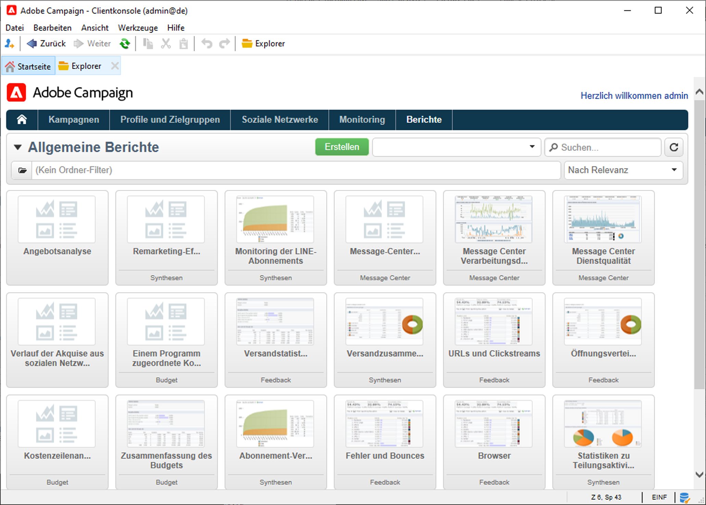
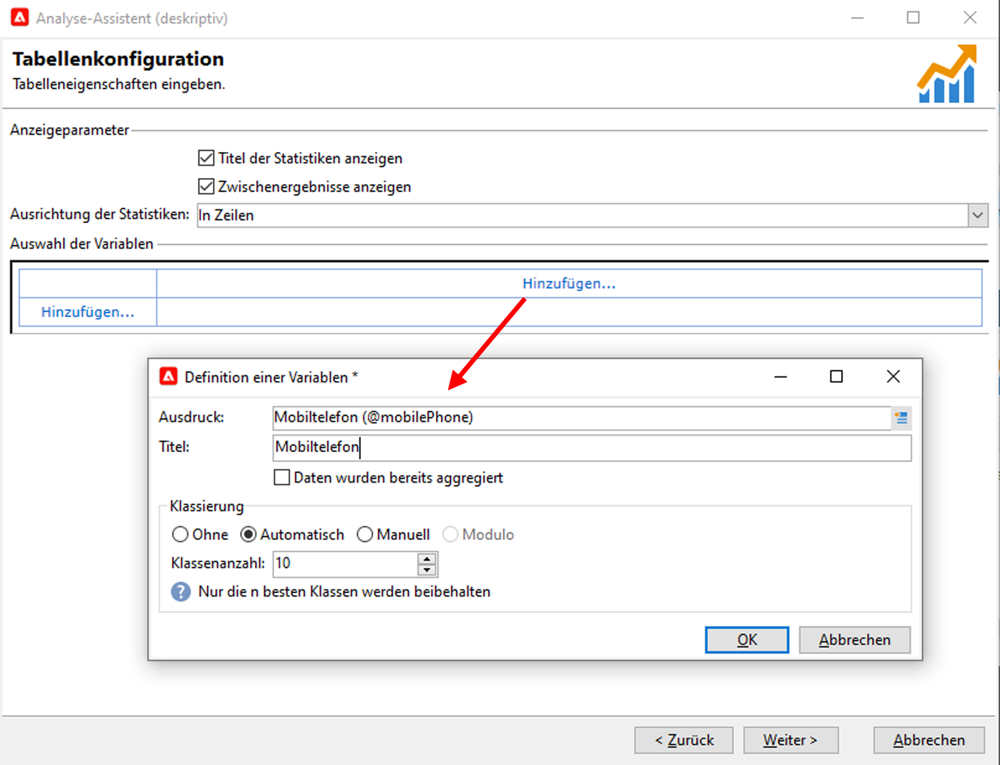
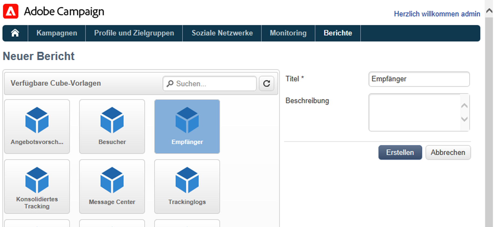

# Metriken und Berichte

## Erste Schritte mit Reporting{#gs-ac-reports}

Adobe Campaign bietet eine Reihe von Reporting-Tools, die auf dieser Seite aufgelistet sind.

* **Native Berichte**

   Adobe Campaign enthält Berichte zu Sendungen, Kampagnen, Plattformaktivitäten, optionalen Funktionen usw. Diese Berichte stehen über die verschiedenen Funktionen zur Verfügung, auf die sie sich beziehen. Sie können an Ihre individuellen Bedürfnisse angepasst werden.

   Verwenden Sie die Registerkarte **Berichte**, um auf diese Berichte zuzugreifen.

   

    Die nativen Berichte von Campaign werden in der [Dokumentation zu Campaign Classic v7](https://experienceleague.adobe.com/docs/campaign-classic/using/reporting/accessing-built-in-reports/about-campaign-built-in-reports.html?lang=de){target=&quot;_blank&quot;} aufgeführt.

* **Deskriptive Datenanalyse**

   Adobe Campaign bietet ein visuelles Tool zur Erstellung von Statistiken zu den Daten in der Datenbank. Diese ermöglichen die Erstellung deskriptiver Analysen anhand eines speziellen Assistenten, deren Inhalt und Layout Sie nach Bedarf anpassen können.

   Verwenden Sie das Menü **[!UICONTROL Tools > Deskriptive Analyse...]**, um einen neuen Bericht zu erstellen.

   

    Die Berichte zur deskriptiven Analyse von Campaign werden in der [Dokumentation zu Campaign Classic v7](https://experienceleague.adobe.com/docs/campaign-classic/using/reporting/analyzing-populations/about-descriptive-analysis.html?lang=de){target=&quot;_blank&quot;} angezeigt.

* **Personalisierte Berichte**

   Verwenden Sie Adobe Campaign, um Berichte zu den Daten in der Datenbank zu erstellen. Sobald diese erstellt wurden, machen Sie sie in den entsprechenden Kontexten zugänglich.

    Die Schritte zum Erstellen eines Berichts werden in der [Dokumentation zu Campaign Classic v7](https://experienceleague.adobe.com/docs/campaign-classic/using/reporting/creating-new-reports/about-reports-creation-in-campaign.html?lang=de){target=&quot;_blank&quot;} beschrieben. Die Erstellung personalisierter Berichte ist erfahrenen Benutzern vorbehalten.

* **Cubes**

   
Mit Cubes können Sie Daten analysieren und messen, Statistiken erheben und das Reporting einschließlich der darin durchgeführten Berechnungen optimieren.  Sie können die Kapazitäten zur Datenexploration und -analyse erweitern und Endbenutzern die Konfiguration von Berichten und Tabellen erleichtern. Sie müssen lediglich einen existierenden (vollständig konfigurierten) Cube auswählen, wenn Sie einen Bericht oder eine Tabelle erstellen, um Berechnungen, Messungen und Statistiken zu verarbeiten.

   

   Je nach Komplexität der Abfragen und Berechnungen sowie der bewegten Datenmenge werden die in den Berichten zu analysierenden Daten über eine Abfrage gesammelt und in einer Liste (Workflow vom Typ &quot;Daten-Management&quot;) oder einem Cube (unter Verwendung der Option &quot;Marketing Analytics&quot;) voraggregiert. Sie werden in Form einer Pivot-Tabelle oder einer Liste mit Gruppierung angezeigt.

    Wie Sie Cubes erstellen, erfahren Sie in der [Dokumentation zu Campaign Classic v7](https://experienceleague.adobe.com/docs/campaign-classic/using/reporting/designing-reports-with-cubes/about-cubes.html?lang=de){target=&quot;_blank&quot;}.

Beachten Sie, dass Adobe Campaign-Berichte optimiert sind und bessere Skalierungsfunktionen als Campaign Classic v7 bieten. Die bestehenden Einschränkungen gelten nicht für Cubes.
