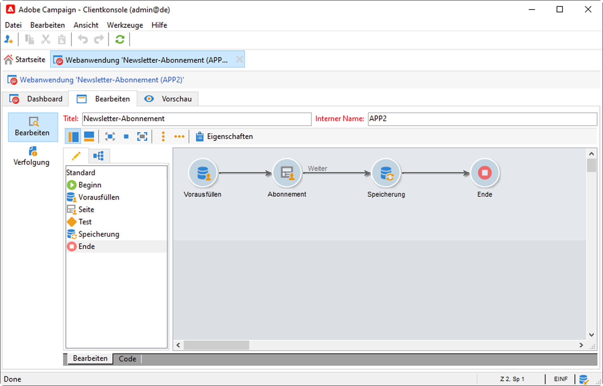

# Verwaltung von Abonnements und Abmeldungen{#optin-optout}

Mit Adobe Campaign können Sie Informations-Services wie Newsletter erstellen und überwachen und die Abonnements/Abmeldungen für diese verwalten. Dabei können mehrere Services parallel definiert werden, z. B. spezialisierte Newsletter für bestimmte Kategorien, Themen oder Bereiche einer Website, Abonnements zu verschiedenen Arten von Warnmeldungen und Echtzeitbenachrichtigungen. Weiterführende Informationen finden Sie im Abschnitt &quot;Abonnements verwalten&quot;.

 Näheres dazu, wie Sie einen Informations-Service erstellen, Newsletter versenden und Opt-in- und Opt-out-Anfragen verwalten, finden Sie in der [Dokumentation zu Campaign Classic v7](https://experienceleague.adobe.com/docs/campaign-classic/using/sending-messages/subscriptions-and-referrals/managing-subscriptions.html?lang=de).{target=&quot;_blank&quot;}

Folgende Optionen stehen zum Anmelden (Opt-in) eines Profils für einen Service zur Verfügung:

* Service manuell dem Empfängerprofil hinzufügen: Klicken Sie auf der Registerkarte **[!UICONTROL Abonnements]** des Empfängerprofils auf **[!UICONTROL Hinzufügen]** und wählen Sie den gewünschten Service aus.

   

    Weitere Informationen finden Sie in der [Dokumentation zu Campaign Classic v7](https://experienceleague.adobe.com/docs/campaign-classic/using/getting-started/profile-management/editing-a-profile.html?lang=de#deliveries-tab).{target=&quot;_blank&quot;}

* Eine Gruppe von Empfängern automatisch für einen Service anmelden: Die Empfängerliste kann aus einem Filtervorgang, einer Gruppe, einem Ordner, einem Import oder einer direkten manuellen Auswahl erstellt werden. Um diese Empfänger anzumelden, wählen Sie die Profile aus und klicken Sie mit der rechten Maustaste. Wählen Sie **[!UICONTROL Aktionen > Auswahl für einen Dienst anmelden...]**.

   

   Wählen Sie den betreffenden Dienst aus und starten Sie den Vorgang.

   

    Weitere Informationen finden Sie in der [Dokumentation zu Campaign Classic v7](https://experienceleague.adobe.com/docs/campaign-classic/using/getting-started/profile-management/editing-a-profile.html?lang=en#deliveries-tab){target=&quot;_blank&quot;}.

* Importieren Sie Empfänger und lassen Sie sie automatisch einen Informations-Service abonnieren. Wählen Sie dazu im letzten Schritt des Importassistenten den betreffenden Service aus.

    Weitere Informationen finden Sie in der [Dokumentation zu Campaign Classic v7](https://experienceleague.adobe.com/docs/campaign-classic/using/getting-started/importing-and-exporting-data/generic-imports-exports/executing-import-jobs.html?lang=de#step-5—additional-step-when-importing-recipients){target=&quot;_blank&quot;}.

* Empfänger melden sich persönlich über ein Web-Formular an.

   

   Campaign verfügt über ein standardmäßiges Web-Formular zur Opt-in-Verwaltung. Sie können es personalisieren und die Profildaten zuordnen.

   

    Weitere Informationen finden Sie in der [Dokumentation zu Campaign Classic v7](https://experienceleague.adobe.com/docs/campaign-classic/using/designing-content/web-forms/use-cases--web-forms.html?lang=de#create-a-subscription--form-with-double-opt-in){target=&quot;_blank&quot;}.

* Erstellen Sie einen Zielgruppen-Workflows und nutzen Sie die Aktivität **[!UICONTROL Anmeldedienst]**.

   

   Weitere Informationen finden Sie auf [dieser Seite](https://experienceleague.adobe.com/docs/campaign/automation/workflows/wf-activities/targeting-activities/subscription-services.html?lang=de).

Folgende Optionen stehen zum Abmelden (Opt-out) eines Profils von einem Service zur Verfügung:

**Manuelles Abmelden**

* Personalisierter Abmelde-Link oder Web-Formular
* Manuelles Löschen eines Informations-Service
* Manuelles Löschen von Empfängern eines bestimmten Anmelde-Service

**Automatische Abmeldung**

* Bestimmen Sie eine maximale Dauer für den Informations-Service: Bei Ablauf der Dauer werden Empfänger automatisch abgemeldet. Dieser Zeitraum wird auf der Registerkarte &quot;Bearbeiten&quot; der Service-Eigenschaften angegeben. Sie wird in Tagen definiert.
* Einrichten eines Abmelde-Workflows für eine Population.

 Weitere Informationen finden Sie in der [Dokumentation zu Campaign Classic v7](https://experienceleague.adobe.com/docs/campaign-classic/using/sending-messages/subscriptions-and-referrals/managing-subscriptions.html?lang=de#unsubscribing-a-recipient-from-a-service){target=&quot;_blank&quot;}.

>[!CAUTION]
>
>Im Kontext einer [Enterprise (FFDA)-Implementierung](../architecture/enterprise-deployment.md) sind An- und Abmeldungen **asynchrone** Prozesse. Opt-in und Opt-out-Anfragen werden stündlich verarbeitet. [Weitere Informationen](../architecture/new-apis.md#sub-apis)

<!--
You can also enable your delivery recipients to forward messages to a friend. To do this, insert the relevant links into your delivery. You may then track this sharing process as well as the number of visits to the concerned pages. 

 For more on this capability, refer to [Campaign Classic v7 documentation](https://experienceleague.adobe.com/docs/campaign-classic/using/sending-messages/subscriptions-and-referrals/viral-and-social-marketing.html?lang=en#viral-marketing--forward-to-a-friend){target="_blank"}
-->
