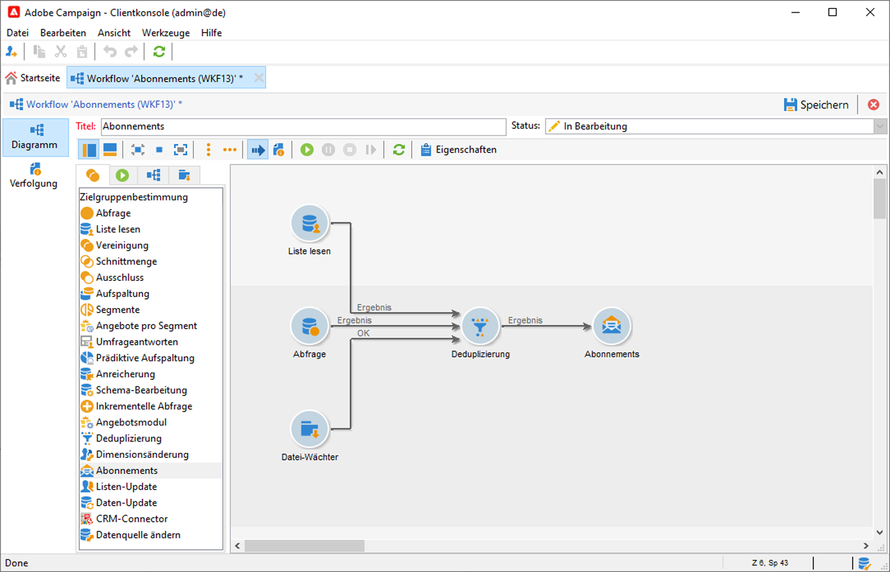

# Verwaltung von Abonnements und Abmeldungen{#optin-optout}

Mit Adobe Campaign können Sie Informations-Services wie Newsletter erstellen und überwachen und die Abonnements/Abmeldungen für diese verwalten. Dabei können mehrere Services parallel definiert werden, z. B. spezialisierte Newsletter für bestimmte Kategorien, Themen oder Bereiche einer Website, Abonnements zu verschiedenen Arten von Warnmeldungen und Echtzeitbenachrichtigungen. Weiterführende Informationen finden Sie im Abschnitt &quot;Abonnements verwalten&quot;.

[!DNL :arrow_upper_right:] Näheres dazu, wie Sie einen Informations-Service erstellen, Newsletter versenden und Opt-in- und Opt-out-Anfragen verwalten, finden Sie in der [Dokumentation zu Campaign Classic v7](https://experienceleague.adobe.com/docs/campaign-classic/using/sending-messages/subscriptions-and-referrals/managing-subscriptions.html?lang=de).{target=&quot;_blank&quot;}

Folgende Optionen stehen zum Anmelden (Opt-in) eines Profils für einen Service zur Verfügung:

* Service manuell dem Empfängerprofil hinzufügen: Klicken Sie auf der Registerkarte **[!UICONTROL Abonnements]** des Empfängerprofils auf **[!UICONTROL Hinzufügen]** und wählen Sie den gewünschten Service aus.

   

   [!DNL :arrow_upper_right:] Weitere Informationen finden Sie in der [Dokumentation zu Campaign Classic v7](https://experienceleague.adobe.com/docs/campaign-classic/using/getting-started/profile-management/editing-a-profile.html?lang=de#deliveries-tab).{target=&quot;_blank&quot;}

* Eine Gruppe von Empfängern automatisch für einen Service anmelden: Die Empfängerliste kann aus einem Filtervorgang, einer Gruppe, einem Ordner, einem Import oder einer direkten manuellen Auswahl erstellt werden. Um diese Empfänger anzumelden, wählen Sie die Profile aus und klicken Sie mit der rechten Maustaste. Wählen Sie **[!UICONTROL Aktionen > Auswahl für einen Dienst anmelden...]**.

   

   Wählen Sie den betreffenden Dienst aus und starten Sie den Vorgang.

   

   [!DNL :arrow_upper_right:] Weitere Informationen finden Sie in der  [Campaign Classic v7-Dokumentation](https://experienceleague.adobe.com/docs/campaign-classic/using/getting-started/profile-management/editing-a-profile.html?lang=en#deliveries-tab){target=&quot;_blank&quot;}

* Empfänger im Zuge eines Imports für einen Service anmelden. Geben Sie im letzten Schritt des Import-Assistenten den gewünschten Service an.

   [!DNL :arrow_upper_right:] Weitere Informationen finden Sie in der [Dokumentation zu Campaign Classic v7](https://experienceleague.adobe.com/docs/campaign-classic/using/getting-started/importing-and-exporting-data/generic-imports-exports/executing-import-jobs.html?lang=de#step-5—additional-step-when-importing-recipients).{target=&quot;_blank&quot;}

* Empfänger melden sich persönlich über ein Web-Formular an.

   

   Campaign verfügt über ein Standard-Webformular zur Verwaltung der Anmeldung. Sie können sie personalisieren und die Profildaten zuordnen.

   

   [!DNL :arrow_upper_right:] Weitere Informationen finden Sie in der  [Campaign Classic v7-Dokumentation](https://experienceleague.adobe.com/docs/campaign-classic/using/designing-content/web-forms/use-cases--web-forms.html?lang=de#create-a-subscription--form-with-double-opt-in){target=&quot;_blank&quot;}

* Empfänger unter Verwendung eines Zielgruppen-Workflows mit der Aktivität **[!UICONTROL Anmeldedienst]** anmelden.

   

   [!DNL :arrow_upper_right:] Weitere Informationen finden Sie in der [Dokumentation zu Campaign Classic v7](https://experienceleague.adobe.com/docs/campaign-classic/using/automating-with-workflows/targeting-activities/subscription-services.html?lang=de#example--subscribe-a-list-of-recipients-to-a-newsletter).{target=&quot;_blank&quot;}

Folgende Optionen stehen zum Abmelden (Opt-out) eines Profils von einem Service zur Verfügung:

**Manuelles Abmelden**

* Personalisierter Abmelde-Link oder Web-Formular
* Manuelles Löschen eines Informations-Service
* Manuelles Löschen von Empfängern eines bestimmten Anmelde-Service

**Automatische Abmeldung**

* Bestimmen Sie eine maximale Dauer für den Informations-Service: Bei Ablauf der Dauer werden Empfänger automatisch abgemeldet. Dieser Zeitraum wird auf der Registerkarte &quot;Bearbeiten&quot; der Service-Eigenschaften angegeben. Sie wird in Tagen definiert.
* Einrichten eines Abmelde-Workflows für eine Population.

[!DNL :arrow_upper_right:] Weitere Informationen finden Sie in der  [Campaign Classic v7-Dokumentation](https://experienceleague.adobe.com/docs/campaign-classic/using/sending-messages/subscriptions-and-referrals/managing-subscriptions.html?lang=de#unsubscribing-a-recipient-from-a-service){target=&quot;_blank&quot;}

>[!CAUTION]
>
>Abonnements und Abmeldungen sind **asynchrone** Prozesse. Opt-in und Opt-out-Anfragen werden stündlich verarbeitet. [Weitere Informationen](../dev/new-apis.md#sub-apis)

Sie können es Ihren Versandempfängern auch ermöglichen, Nachrichten an Freunde weiterzuleiten. Fügen Sie dazu die entsprechenden Links in Ihren Versand ein. Sie können diesen Freigabeprozess sowie die Anzahl der Besuche auf den betroffenen Seiten tracken.

[!DNL :arrow_upper_right:] Weitere Informationen zu dieser Funktion finden Sie in der Dokumentation zu  [Campaign Classic v7](https://experienceleague.adobe.com/docs/campaign-classic/using/sending-messages/subscriptions-and-referrals/viral-and-social-marketing.html?lang=de#viral-marketing--forward-to-a-friend){target=&quot;_blank&quot;}