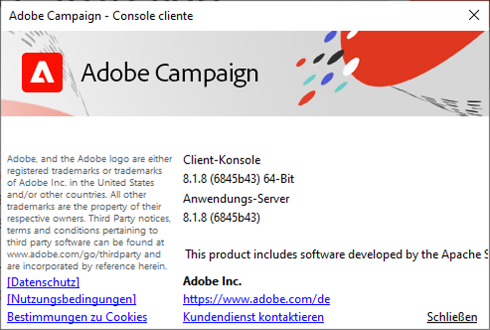

# Versionen und Upgrades {#upgrades}

Adobe Campaign v8 wird ausschließlich als **Managed Cloud Services**-Lösung angeboten. Adobe verwaltet und führt jedes Server-seitige Upgrade für Sie durch - es gibt keine lokale oder hybride Bereitstellung von v8 und kein Server-Upgrade, um es selbst zu planen oder durchzuführen.

Adobe Campaign wird regelmäßig aktualisiert. Diese regelmäßige Aktualisierungshäufigkeit zielt darauf ab, Ihnen die neuesten und besten Funktionen bereitzustellen, Ihre Umgebung sicher zu halten und Ihr Produkterlebnis zu verbessern.

Benutzer von Managed Cloud Services:

* Ihre Campaign-Server-Instanz wird von Adobe mit jeder neuen Version automatisch und ohne Aktion Ihrerseits aktualisiert.
* Ihr Adobe-Support-Mitarbeiter setzt sich vor einem Upgrade, das sich auf Ihre Umgebung auswirkt, mit Ihnen in Verbindung.
* **Die Client-Konsole ist die Komponente, für die Sie verantwortlich sind.** Sie muss auf dieselbe Version aktualisiert werden wie Ihr Campaign-Server. Auf [dieser Seite](../start/connect.md#upgrade-ac-console) erfahren Sie, wie Sie Ihre Client-Konsole aktualisieren.

Außerdem sollten Sie als Kundin bzw. Kunde sicherstellen, dass Sie die neuesten unterstützten Versionen der in der [Kompatibilitätsmatrix](compatibility-matrix.md) aufgeführten Systeme verwenden.

>[!IMPORTANT]
>
>Adobe behält sich das Recht vor, jederzeit ohne vorherige Ankündigung kritische Sicherheits-Patches auf Ihre gehostete Umgebung anzuwenden, um Sicherheitslücken so schnell wie möglich zu beheben. Diese Patches werden ohne Service-Unterbrechung bereitgestellt. Die Behebung einer kritischen Sicherheitslücke hat Vorrang vor der Vorabbenachrichtigung.

## Campaign-Versionen {#versions}

Adobe Campaign veröffentlicht regelmäßig Produktversionen, die die Leistung, Sicherheit, Logik und Benutzerfreundlichkeit der Campaign-Infrastruktur verbessern.

Bei den Upgrades kann es sich um folgende Arten handeln:

* **Wichtige Upgrades**, von einer Hauptversion auf eine andere, z. B. von v7 zu v8. Diese Upgrades beinhalten neue Funktionen, Verbesserungen, Kompatibilitäts- und Sicherheitsaktualisierungen sowie Fehlerbehebungen.
* **Geringfügige Upgrades** von einer Nebenversion zur anderen, z. B. von v8.5 zu v8.6. Diese Upgrades beinhalten Verbesserungen, Kompatibilitäts- und Sicherheitsaktualisierungen sowie Fehlerbehebungen.
* **Patch-**: von einer Patch-Version auf eine andere, z. B. von v8.5.1 auf v8.5.2. Diese Upgrades beinhalten Sicherheitsaktualisierungen und -korrekturen.

Detaillierte Informationen zu den einzelnen neuen Versionen finden Sie in den [Versionshinweisen](release-notes.md). Sicherheitsbezogene Fehlerbehebungen werden in den jeweiligen Versionshinweisen aufgeführt - siehe [Wie kann ich über die Veröffentlichung einer neuen Version informiert werden?](#upgrades-0) Unten.

Um eine stabile Konfiguration sicherzustellen, empfiehlt Adobe, **genau dieselbe Version** auf allen Campaign-Servern zu installieren. Außerdem muss sich die Client-Konsole, sofern in den [Versionshinweisen](release-notes.md) nicht anders angegeben, auf **genau derselben Version** wie die Server-Instanz befinden. Weitere Informationen dazu, wie Sie die Client-Konsole aktualisieren, erhalten Sie auf [dieser Seite](../start/connect.md#upgrade-ac-console).

## Halten Sie Ihre Client-Konsole auf dem neuesten Stand {#ac-upgrades}

Wenn Sie Campaign Managed Services-Kunde sind und eine neue Campaign-Version verfügbar ist, wird Ihre Serverinfrastruktur von Adobe aktualisiert, ohne dass Sie diesbezüglich weitere Maßnahmen ergreifen müssen.

Da das Server-Upgrade automatisch durchgeführt wird **kann an der** Client-Konsole“ eine Lücke entstehen, wenn diese nicht gleichzeitig aktualisiert wird. Wenn Ihre Konsolenversion nicht mit Ihrer Server-Version übereinstimmt:

* Sie können die Möglichkeit verlieren, eine Verbindung zu Ihrer Campaign-Instanz herzustellen, bis die Konsole aktualisiert wird.
* Die Konsole profitiert nicht mehr von den Fehlerbehebungen und Sicherheitsaktualisierungen, die in der Version bereitgestellt werden, zu der der Server bereits verschoben wurde - obwohl der Server selbst aktuell ist.

Um dies zu vermeiden, aktualisieren Sie Ihre Client-Konsole, sobald Sie über eine neue Version benachrichtigt werden. Erfahren Sie, wie Sie [Ihre Client-Konsole aktualisieren](../start/connect.md#upgrade-ac-console).

Beachten Sie, dass Sie als Kunde bzw. Kundin auch sicherstellen müssen, dass Sie die neuesten unterstützten Versionen der in der (Kompatibilitätsmatrix[&#x200B; aufgelisteten Systeme &#x200B;](compatibility-matrix.md).

## Häufig gestellte Fragen {#upgrades-faq}

### So überprüfen Sie Ihre Campaign-Version {#version}

Öffnen Sie über die Client-Konsole das Menü **Hilfe > Über…**, um Ihre Campaign-Version zu überprüfen.

Sie erhalten folgende Informationen:

* **Versionsnummer** Ihrer Client-Konsole und des Anwendungs-Servers. Im obigen Beispiel wird Version 8.1.5 der Client-Konsole und des Anwendungs-Servers verwendet.
* Die SHA-Nummer zwischen Klammern
* Link zur Adobe-Kundenunterstützung
* Links zur Adobe-Datenschutzrichtlinie sowie zu Nutzungsbedingungen und Bestimmungen zu Cookies.

>[!NOTE]
>
>Wenn die für Ihre Client-Konsole angezeigte Version nicht mit der für Ihren Anwendungs-Server angezeigten Version übereinstimmt, aktualisieren Sie Ihre Konsole wie unter [Halten Sie Ihre Client-Konsole auf dem neuesten Stand](#ac-upgrades) beschrieben.

### So erhalten Sie Informationen zu Veröffentlichungen neuer Versionen {#upgrades-0}

Neue Versionen und die damit verbundenen Änderungen, einschließlich Sicherheitskorrekturen, sind in den [Versionshinweisen](release-notes.md) aufgeführt. Sobald eine neue Version verfügbar ist, setzt sich der Adobe-Support mit Ihnen in Verbindung und aktualisiert Ihre Serverumgebungen. Sie müssen die Client-Konsole separat aktualisieren (siehe [Halten Sie die Client-Konsole auf dem neuesten Stand](#ac-upgrades)).

Um über neue Versionen von Experience Cloud-Lösungen und deren Inhalt informiert zu werden, abonnieren Sie die Mitteilung [Adobe Priority Product Updates](https://www.adobe.com/de/subscription/priority-product-update.html){target="_blank"}.

Sie können auch die [Campaign-Community](https://experienceleaguecommunities.adobe.com/t5/custom/page/page-id/Community-TopicsPage?profile.language=de&style=all&sort=date&order=desc&filters=adobe-campaign-classic-community&topic=Campaign+v8){target="_blank"} besuchen, um über Versionsaktualisierungen informiert zu werden.

### Warum benötigt meine Organisation ein Upgrade? {#upgrades-1}

Durch ein Upgrade wird sichergestellt, dass Ihr Konto vor Sicherheitslücken geschützt ist und die aktuelle Leistungstechnologie verwendet.

Normalerweise bietet ein Upgrade auf die neueste Version Folgendes:

* **Verbesserte Sicherheit**

  Sicherheit erfordert ständige Überwachung und vorausschauende Wartung. Sicherheitsrisiken sind allgegenwärtig und können nicht ignoriert werden. Jedes Upgrade für Campaign verbessert die Sicherheit. Um Adobe Campaign zu unterstützen, müssen Technologien kombiniert werden, und alle müssen auf dem neuesten Stand gehalten werden. Adobe wendet diese Updates automatisch auf Ihren Server an. Durch das schrittweise Upgrade Ihrer Client-Konsole wird derselbe Schutz gewährleistet, der auch für sie gilt.

* **Verbesserter Support**

  Die meisten kritischen Probleme werden mit Upgrades behoben und können vollständig vermieden werden. Regelmäßige Upgrades tragen dazu bei, Ihre Herausforderungen zu reduzieren und die Effizienz zu steigern. Das Volumen der Kundenunterstützung wird reduziert, was schnellere Lösungen und mehr Aufmerksamkeit für Probleme ermöglicht, die nicht mit Upgrades in Zusammenhang stehen.

* **Verbesserte Wartung und Stabilität**

  Im Laufe der Zeit ermittelt das Adobe Campaign-Team Möglichkeiten zur Verbesserung der Stabilität und Leistung des Produkts sowie zur Behebung bekannter Probleme. Durch ein Upgrade erhält Ihre Instanz diese Verbesserungen auf dem neuesten Stand und beseitigt gängige Probleme, die Unternehmen mit schnellem Wachstum und/oder hoher Komplexität in ihren Campaign-Instanzen erleben. Verbesserungen im gesamten Technologie-Stack von Campaign sind sowohl für Marketing- als auch für IT-Teams in Ihrer Organisation spürbar.

* **Bleiben Sie in Verbindung**

  Die Client-Konsole kann nur zuverlässig mit einem Server kommunizieren, auf dem dieselbe Version ausgeführt wird. Diese Verbindung und die damit verbundenen Sicherheits- und Fehlerbehebungen bleiben intakt, indem die Konsole auf dem neuesten Stand gehalten wird - und zwar jedes Mal, wenn der Server aktualisiert wird.

### Wie sieht das Verfahren und der Zeitplan für ein Upgrade aus? {#upgrades-2}

Als v8-Kunde verwaltet Adobe das Server-Upgrade durchgängig:

1. Wenn eine neue Version verfügbar ist oder Ihr Konto als Benutzer identifiziert wird, der zu einer neuen Version wechseln muss, werden Sie von Ihrem Adobe-Support-Mitarbeiter benachrichtigt.
1. Adobe aktualisiert Ihre Serverinfrastruktur. Für diesen Schritt ist keine Aktion erforderlich.
1. Die einzige erforderliche Aktion besteht einerseits darin, die Client-Konsole entsprechend zu aktualisieren, und andererseits darin, zu bestätigen, dass die Systeme in Ihrer [Kompatibilitätsmatrix](compatibility-matrix.md) weiterhin unterstützt werden. Siehe [Halten Sie Ihre Client-Konsole auf dem neuesten &#x200B;](#ac-upgrades).

Ein Team aus engagierten Kundenbetreuern, Produkt-Managern, Ingenieuren, TechOps-Spezialisten und Produktberatern steht Ihnen zur Seite, um diesen Prozess möglichst reibungslos zu gestalten.

>[!NOTE]
>
>Kritische Sicherheits-Patches können außerhalb dieses Benachrichtigungszyklus auf Ihre gehostete Umgebung angewendet werden - siehe den Hinweis oben auf dieser Seite.
