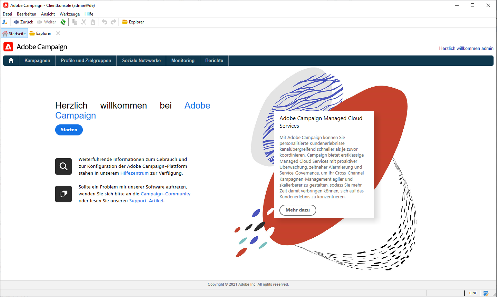
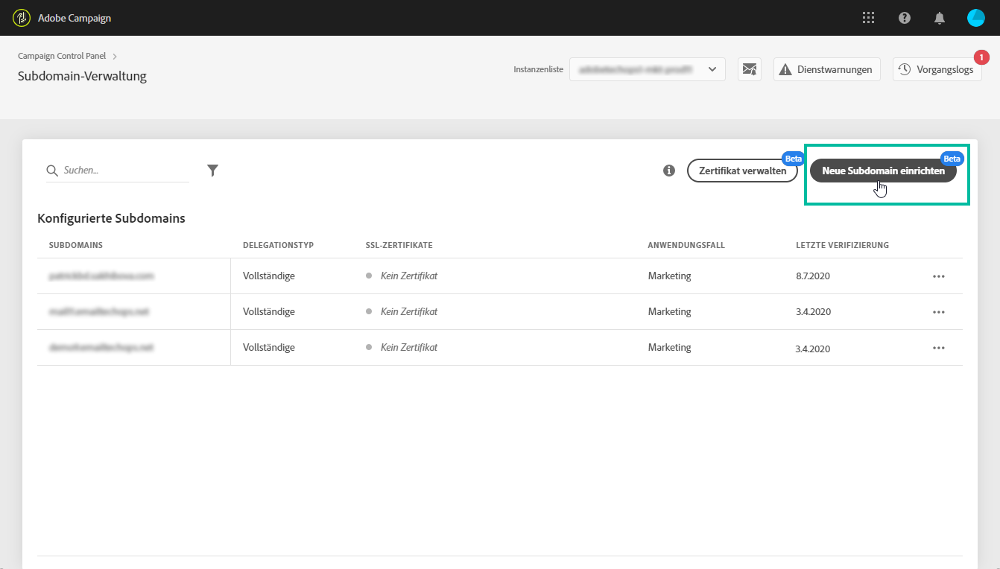

# Neue Funktionen in Adobe Campaign v8  {#ac-gs-what-is-new}

Adobe Campaign v8 wurde für Marketer entwickelt, die eine branchenführende Cloud-Lösung für das kanalübergreifende Kampagnen-Management für das gesamte Unternehmen benötigen. Adobe Campaign v8 bietet zuverlässige ETL- und Daten-Management-Funktionen, mit denen Sie die perfekte Kampagne erstellen und kuratieren können. Die Orchestrierungs-Engine bietet umfassende Marketing-Programme für unterschiedliche Kontaktpunkte mit einem Schwerpunkt auf Batch-basierten Journeys. Adobe Campaign v8 ist außerdem mit einem skalierbaren Echtzeit-Messaging-Server verbunden, der es Marketing-Teams ermöglicht, vordefinierte Nachrichten basierend auf einer umfassenden Payload von jedem IT-System für Dinge wie Passwortrücksetzung, Bestellbestätigung, E-Quittung und vieles mehr zu senden.

Adobe Campaign v8 bietet erhebliche Verbesserungen in den Bereichen Infrastruktur, Sicherheit, Zustellbarkeit und Monitoring.

## Wichtigste Funktionen{#key-capabilities}

Die wichtigsten Funktionen ermöglichen Folgendes:

* **Zentrale Workflow-Verwaltung**. Verbessern Sie die Geschwindigkeit und den Umfang aller Aspekte Ihrer Marketing-Kampagnen, von der Erstellung von Segmenten und der Vorbereitung von Nachrichten bis hin zum Versand.

   Adobe Campaign erleichtert Ihnen die Synchronisation Ihrer Kanäle mithilfe einer zentralen, benutzerfreundlichen Benutzeroberfläche für die Kampagnenorchestrierung. Auf diese Weise können Ihre Online-Kanäle – wie E-Mail, Internet, Mobile und Social Media – optimal auf Ihre Offline-Kanäle abgestimmt werden, einschließlich Briefpost, Callcenter, Ladengeschäft usw. Adobe Campaign ermöglicht es Ihnen, Ihren Kunden ein konsistentes und kontextbezogenes Erlebnis in digitalen und traditionellen Kanälen bereitzustellen. Adobe Campaign vereinfacht die Bereitstellung von Inhalten für alle Pfade, für die sich Ihre Kunden entscheiden können – auf jedem beliebigen Kanal.

    [Weitere Informationen zu Workflows in Campaign](../config/workflows.md)

* **Personalisiertes E-Mail-Marketing**. Erstellen Sie personalisierte und kontextrelevante E-Mails, die mit dem übrigen Kundenerlebnis konsistent sind.

   Mit Adobe Campaign können Sie E-Mails besser, personalisierter und profitabler gestalten. E-Mails können einfach erstellt und versendet werden. Campaign v8 bietet Ihnen die Flexibilität, jede zu versendende Nachricht zu entwerfen, zu personalisieren, zu testen, zu verfeinern und zu verbessern.

    [Weitere Informationen zu Personalisierungsfunktionen](create-message.md)

* **Kundendaten-Management**. Verschaffen Sie sich einen Überblick über Ihre Kunden, damit Sie schnell personalisierte Kampagnen für Ihr gesamtes Unternehmen erstellen können.

   Mit Adobe Campaign können Sie Kundenprofile aus Daten erstellen, die über alle Ihre Kanäle hinweg gesammelt wurden. Mit diesem Profil können Sie Kampagnen kanalübergreifend koordinieren. Indem Sie alle Ihre Marketing-Kanäle verbinden, können Sie die verschiedenen Journeys optimal auf jeden einzelnen Kunden anpassen.

    [Weitere Informationen zum Kundendaten-Management](audiences.md)

* **Erstklassige Kampagnenverwaltung**. Adobe Campaign v8 bietet Marketern erstklassige Funktionen zum kanalübergreifenden Planen, Launchen und Messen von Kampagnen.

   Zu den Funktionen gehört ein integriertes Profil, das eine einheitliche Sicht auf den Kunden bietet. Daten-Management und Segmentierung für die Erstellung von Kampagnenzielgruppen in großem Umfang. Kanalübergreifendes Workflow-Management zur Automatisierung von Multi-Channel- und Multi-Wave-Kampagnen. Integrierter E-Mail-Versand, Verringerung der Abhängigkeit von kostspieligen ESPs. Berichterstellung und Analyse zum Verständnis des Kundenverhaltens und der Kampagnenleistung.

    [Weitere Informationen zur Kampagnenverwaltung](campaigns.md)

* **Verbindungen zu Adobe Experience Platform**. Adobe Campaign v8 unterstützt Data Connectors mit Real-Time CDP und Adobe Experience Platform, sodass Unternehmen das einheitliche Echtzeit-Kundenprofil nutzen können.

   Darüber hinaus ist Adobe Campaign v8 nativ in die Echtzeit-Journey-Orchestration-Funktionen integriert, sodass Marketer dieselben Vorlagen und Versandfunktionen in Adobe Campaign wiederverwenden können, um mit Kunden in Echtzeit zu interagieren. Diese Investitionen werden das Kundenerlebnis mit Adobe Campaign optimieren und neue Anwendungsfälle erschließen, wie z. B. die Möglichkeit, individualisierte Customer Journeys in Echtzeit zu Kampagnen hinzuzufügen.

   Mit Journey-KI können Sie auch eine prädiktive Sendezeitoptimierung und ein prädiktives Interaktivitäts-Scoring konfigurieren und Öffnungsraten, Klicks und Umsätze steigern.

    [Weitere Informationen zu Integrationen mit Campaign](../connect/integration.md)

* **Managed Cloud Services** Adobe Campaign v8 ist als Managed Cloud Service verfügbar und bietet proaktive Überwachung, zeitgerechte Warnmeldungen und Service-Governance.

   Adobe Managed Cloud Service bietet Marketing-Experten eine agilere, sicherere und skalierbarere Lösung für das Cross-Channel-Kampagnen-Management mit niedrigen Gesamtbetriebskosten. Das neue Angebot kombiniert Services mit einer proaktiven Überwachung und rechtzeitigen Warnmeldungen.

* **Geschwindigkeit und Skalierung**. Adobe Campaign kann jetzt Cloud-Skalierungstechnologien nutzen, um Größe und Geschwindigkeit der Datenbank drastisch zu verbessern.

   [Campaign v8 Enterprise](../architecture/enterprise-deployment.md) bietet das Konzept des **Full Federated Data Access** (FFDA): Alle Daten befinden sich nun entfernt in der Cloud-Datenbank. Mit diesem neuen Angebot vereinfacht Campaign v8 das Daten-Management: Es wird kein Index in der Cloud-Datenbank benötigt. Sie müssen nur die Tabellen erstellen, die Daten kopieren und schon können Sie loslegen. [!DNL Snowflake] ist die Campaign Cloud-Datenbank und bringt Ihnen Geschwindigkeit und Ausdauer: Somit vermeiden Sie Überlastung durch Systemaktivitätsspitzen. Die Cloud-Datenbanktechnologie erfordert keine spezielle Wartung, um das Leistungsniveau zu gewährleisten.

    [Weitere Informationen zur Implementierung von Enterprise (FFDA)](../architecture/enterprise-deployment.md)

>[!CAUTION]
>
>* Campaign v8 ist derzeit **nur** als Managed Cloud Service verfügbar und kann nicht in On-Premise- oder Hybridumgebungen bereitgestellt werden.
>
>* Die Migration aus einer bestehenden Campaign Classic v7-Umgebung ist noch nicht möglich.

## Self-Service-Admin-Benutzeroberfläche{#self-service-admin}

Als Produkt-Administrator können Sie mithilfe des **Campaign Control Panels** die Einstellungen jeder Ihrer Campaign v8-Instanzen verwalten und ihre Nutzung nachverfolgen.

Über eine intuitive Benutzeroberfläche können Administratoren die Nutzung wichtiger Assets überwachen, erweiterte Aufgaben wie die Zulassungsauflistung von IP-Adressen, die Überwachung der SFTP-Datenspeicherung, die Schlüsselverwaltung und mehr durchführen. Diese Self-Service-Benutzeroberfläche bietet Ihnen mehr Flexibilität und hilft Ihnen bei Folgendem:

* Schnelles Ändern von Einstellungen, ohne sich an die Adobe-Kundenunterstützung wenden zu müssen
* Konfigurieren von Einstellungen entsprechend Ihren Unternehmensanforderungen zu unterschiedlichen Zeiten
* Erhöhen der Sicherheit, indem die Zugriffseinstellungen nach Bedarf gesteuert werden

 [Weitere Informationen zum Campaign Control Panel](https://experienceleague.adobe.com/docs/control-panel/using/discover-control-panel/key-features.html?lang=de){target=&quot;_blank&quot;}

